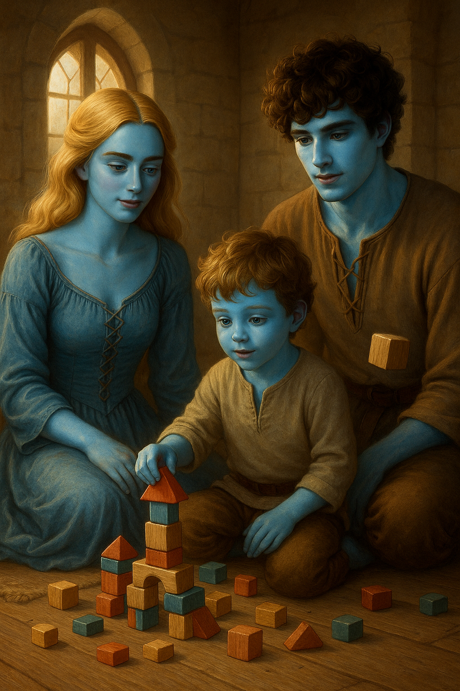
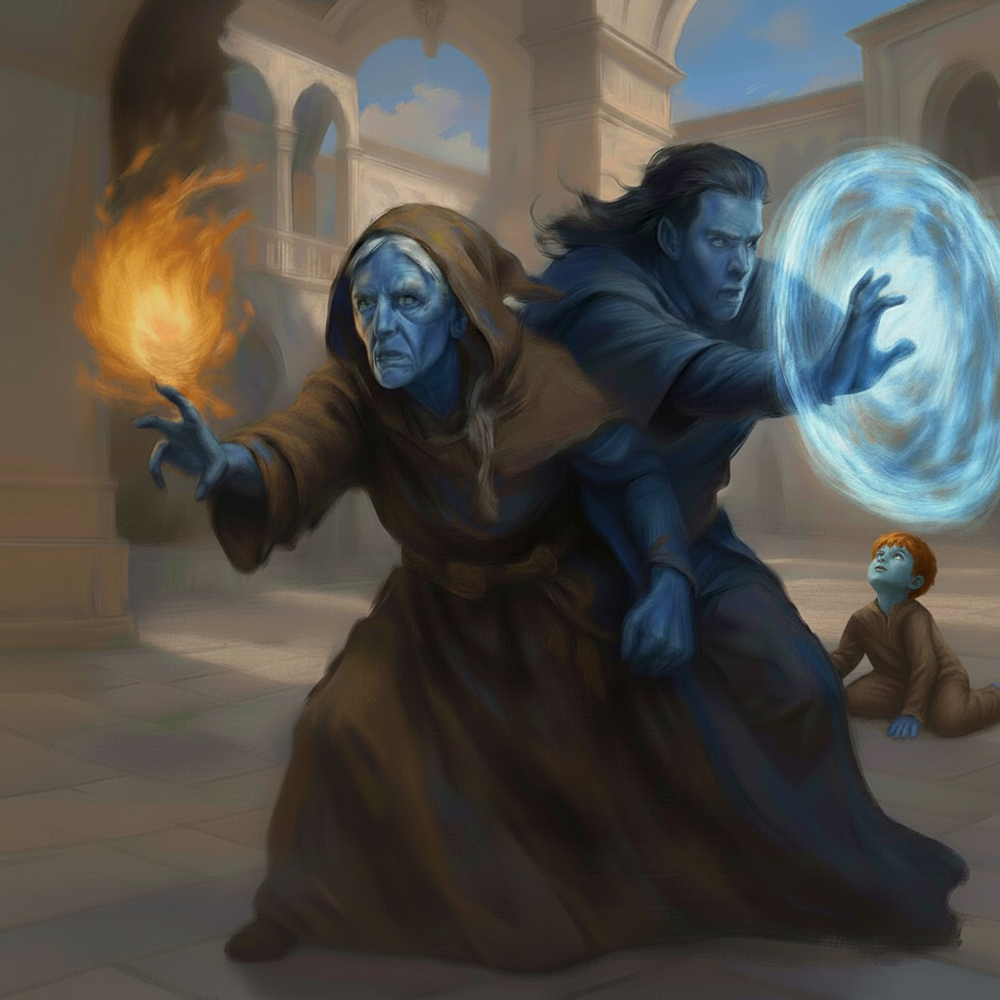

# Jomar rettet die Welt

Der Wind strich lautlos durch die Bäume. Nur das Rascheln vereinzelter Blätter begleitete die drei Gestalten, die sich vorsichtig entlang der Schatten bewegten. Jomar war der Erste. Flach auf dem Bauch robbte er hinter eine niedrige Steinmauer, hob die Hand, spreizte zwei Finger – ein Zeichen an die anderen. Die anderen hielten an. Jomar hockte sich hinter die Mauer.

Vor ihm lag ein unscheinbarer Hof, von verwildertem Gestrüpp durchzogen. Einst war dies ein Garten gewesen, doch nun glich er einem verlassenen Friedhof. Jetzt war es eine Fläche aus verdorrten Pflanzen, staubigem Boden und krummen Holzpflöcken als Beetbegrenzungen. Aber es gab zwei Bereiche, die ordentlich umgegraben waren. Sie wirkten wie frisch ausgehobene Gräber.

Nichts rührte sich, aber etwas lauerte in der Finsternis – eine dunkle Präsenz.  

Er hielt die Luft an. Seine Augen klebten an der Tür – und tatsächlich: Sie öffneten sich, die Angeln kreischten im Widerstand gegen den Rost.

Ein Mann trat heraus. Schlaksig, mit einem fleckigen Umhang, den er sich über die Schulter geworfen hatte wie einen alten Lappen. Er sah sich nicht um, sondern ging direkt auf das ›Gartenbeet‹ zu. Dort blieb er stehen. Jomar duckte sich tiefer. Hektisch fuchtelte er mit der Hand – erst zwei Finger, dann eine Faust, dann eine kreisende Bewegung: bereitmachen.

Der Mann hob die Arme.

Jomar umfasste seinen Schwertgriff fester. Dann kam der Rauch. Dunkel, ölig, schwärzlich wie zu dicke Tinte. Er quoll aus den Händen des Mannes, zuerst langsam, dann schneller, kroch über seine Handflächen, floss in schwarzen Fäden zu Boden, die sich in dunklen Pfützen auf dem Boden sammelten.  Die Erde begann sich zu regen. Erst kaum wahrnehmbar. Etwas grub sich von unten nach oben.

Jomar wollte nicht länger warten.

Er schnellte hoch, rief: »Jetzt!«, und stürmte los.

Die beiden anderen sprangen mit ihm aus den Büschen. Drei gegen einen. Der Magier fuhr erschrocken herum und senkte demonstrativ die Hände, die Arme leicht abgespreizt – eine Geste, die jeder Zauberer kannte: »Ich ergebe mich.«

»Lerto!«, donnerte Jomar, das Schwert in der Hand, das er gar nicht hätte ziehen müssen. »Du wurdest auf frischer Tat beim Wirken schwarzer Magie ertappt!«

Der Mann hob eine Braue und schnaufte durch die Nase. »Was? Die da? Das waren doch bloß magische Maulwürfe. Ich hab’ doch keine blutrünstigen Monster erschaffen … das war mein Nachbar, oder? Der hat mich verpfiffen. Der Schweinehund! Erst beschwert er sich über den Zustand meines Gartens, und jetzt, wo ich etwas dagegen tue, ist ihm das auch wieder nicht recht.«

Jomar ließ sich nicht beirren. Seine Stimme klang, als verlese er die Anklage in einem Gerichtssaal: »Für deine begangenen Vergehen erhältst du nun deine gerechte Strafe.«

Er zog ein zusammengefaltetes Pergament aus der Tasche, schlug es mit einer gewissen Feierlichkeit auf.

»Fünf Goldstücke. Die Buße kannst du in der Zaubererbank begleichen. Gib den Zettel bitte mit ab. Und lass dir eine Quittung geben.«

Lento starrte missmutig auf das Dokument, dann seufzte er. »Wenigstens keine Punkte auf der Zauberer-Lizenz.«

---

>
Kata, Jomar und Ayen

Kata saß mit verschränkten Beinen auf dem Boden und baute mit Ayen einen ausgesprochen wilden Bauernhof. Zwei Ziegen standen auf einem Turm aus Klötzen, ein Drache bewachte das Hühnerhaus, und eine Ente mit Schwert versuchte sich am Pflug.

Jomar öffnete leise die Tür.

»Und?«, fragte Kata, ohne aufzusehen. »Die Welt gerettet?«

»Wie jeden Tag. Immer ein kleines Stückchen mehr.« Sarkasmus legte sich wie Rost auf seine Stimme.

Da sprang Ayen auf, rannte auf ihn zu und warf sich ihm entgegen. »Papa!«

Jomar hob ihn hoch, wirbelte ihn ein paar Mal im Kreis, bis Ayen jauchzte und sein Holzschwert verlor, das daraufhin knapp an Katas Kopf vorbeiflog.

»Ein fliegendes Pferdchen!«, rief er triumphierend.

»Ein sehr gefährliches fliegendes Pferdchen«, sagte Jomar, als er ihn wieder absetzte.

Jomar setzte sich zu seiner Familie und ließ die Ente pflügen und den Drachen über dem Bauernhof kreisen. Dann schnupperte er und runzelte die Stirn. »Hast du … gekocht?«

Kata warf ihm einen traurigen Blick zu. »Ich habe es versucht.«

»Es riecht wie … in einer Köhlerei.«

»Ich wollte Linsen machen.«

»Und wie ist der Versuch ausgegangen?«

»Nicht gut. Irgendwas ist beim Anbraten der Linsen schiefgegangen.«

Ayen kicherte und setzte ein Zicklein auf einen Drachenkopf.

»Wenigstens kommt Marina jeden Tag mit Essen vorbei«, sagte Jomar. »Sonst wäre Ayen längst verhungert. Oder hätte das Kochen übernommen.«

»Ich hatte mal Küchenpersonal«, murmelte Kata. »Und Kammerzofen. Und eine Kinderfrau. Und einen Stallburschen, der besser aussah als du.«

»Wir können versuchen, den zu finden und einzustellen.«

»Wir haben nicht mal Pferde.« Kata seufzte. »Wir haben Tausende Goldstücke für die Rettung Demiranthas bekommen. Und wofür? Keine Diener. Keine Fußbäder. Nicht mal eine Klingel für Tee.«

Jomar grinste. »Solchen Schnickschnack brauchen wir doch nicht.«

»Sagst du.«

Dann wurde Jomar still.

Kata sah es sofort.

»Was?«, fragte sie.

»Nichts. Ich … ich hätte erwartet, dass Efret sich mal meldet. Ich hab’ ihn seit zwei Jahren nicht gesehen.«

Kata legte einen Klotz zur Seite. »Und du vermisst ihn?«

»Ich vermisse … Aufträge. Verantwortung. Abenteuer. ›Nummer Eins‹ – dieser blonde Muskelberg – hat die Tiefebenen von Garch von irgendwelchen schwarzmagisch herbeigezauberten Ork-Troll-Zwergelfen – oder was auch immer – befreit. Und ich sortiere Gartenzwerge mit unserem Sohn.«

»Drachen«, warf Ayen ein.

»Drachen, stimmt.«

»Du bist wichtig, Jomar«, sagte Kata leise. »Hier. Jeden Tag.«

Er sah sie an. Dann Ayen, der gerade eine Ente in einen Belagerungsturm setzte.

»Ich weiß«, sagte er. »Aber manchmal reicht es mir nicht, der Held in einem Spiel aus Holzklötzen zu sein.«

---

Die sanfte Hügellandschaft mündete in einer weitläufigen Wiese, deren weicher Boden den nackten Füßen einen angenehmen Halt bot. Die steil aufragende Stadtmauer umrahmte die hinter ihr liegenden weißen Gebäude der Zaubererstadt.

Ayen rannte wie ein kleiner Sturm, lachte, drehte sich im Kreis, fiel ins Gras und sprang gleich wieder auf. Er trug nichts außer einem breiten Grinsen und einer Mütze, die unter seinem Kinn festgebunden war und nun wild wippte, während er über das Feld tobte.

Die Luft war warm, der Himmel wolkenlos und von einem tiefen, gleichmäßigen Blau. Keine flirrende Hitze, nur angenehme Wärme und strahlendes Licht.

Jomar lag auf dem Rücken und betrachtete das Spiel der Blätter über ihm. Die alten, stämmigen Bäume am Rand der Wiese warfen große Schatten, in denen es angenehm kühl war. Neben ihm saß Kata auf einer Decke, die sie ausgebreitet hatte. Zwei Becher standen zwischen ihnen, dazu ein Teller mit kandierten Apfelstücken, ein Schälchen halbgeschmolzener Schokolade. Der Wein hingegen war kühl geblieben – Jomar hatte ihn entsprechend verzaubert.

»Weißt du was?«, sagte Jomar schließlich, ohne den Blick von den Blättern zu lösen.

»Was?«, fragte Kata und kaute langsam.

»Ich bin zufrieden.«

Sie schob den Apfel mit der Zunge in die Wange und sah ihn schräg an. »Das klingt verdächtig. Kommt jetzt ein ›Aber‹?«

»Nein. Ich hab’ eine Frau, die mich aushält. Einen Sohn, der das Leben besser macht. Und ich liege auf einer Decke und muss heute ausnahmsweise keine Berichte schreiben, keine Patrouille führen und keine blutrünstigen Schwarzmagier verhaften.«

»Du meinst, heute gab es keine illegalen Maulwurfbeschwörungen?«

»Nicht dass ich wüsste. Und wenn, wär’s mir egal, ich hab’ ja keinen Dienst.«

Kata lehnte sich zurück und stützte sich auf die Hände. »Sag nicht zu laut, dass du zufrieden bist. Das Schicksal hört immer zu.«

Jomar lachte leise. »Dann soll es wissen, dass ich bereit bin, mich ihm zu stellen.«

Nun legte sich auch Kata auf den Rücken, die Hände hinter dem Kopf verschränkt,

»Hast du eigentlich mal wieder etwas von Jaad gehört?«, fragte sie nach einer Weile.

Jomar drehte den Kopf zu ihr. »Ich hab’ sie schon ewig lange nicht mehr gesehen, aber sie ist jetzt im Rat der Zauberer, soweit ich weiß.«

»Ernsthaft? Wie alt ist sie jetzt? 23 … 24? Da dürfte sie wohl die Jüngste sein. Da sitzen doch nur alte Säcke.«

»Efret hat ja schon immer große Stücke auf sie gehalten.«

Kata zuckte mit den Schultern. »Jaad hat ihren Platz gefunden. Vielleicht sogar den, der ihr immer zugestanden hat.«

»Und Kalem?«, fragte Kata.

Jomar schnaubte leise. »Er lebt noch immer in seiner Villa in Königsstadt. An seiner positiven Einstellung zum Leben hat sich nichts geändert.«

»Arbeitet er noch für Efret?«

»Natürlich. Nur hört man davon nichts. Er ist halt ein sehr diskreter Spion.«

»Also Spionage, schwerer Wein und leichte Mädchen, alles wie immer?«

»Wahrscheinlich. Ich frage mich, wann er die ganzen Goldstücke verprasst haben wird, die wir damals bekommen haben.«

Kata grinste. »Gold war ihm – glaube ich – niemals wirklich wichtig. Selbst wenn alles weg ist, wird ihm das nicht die Laune verhageln.«

Ayen kam zurückgelaufen, schnappte sich mit beiden Händen je ein Stück kandierten Apfel, stopfte sie sich in den Mund, grinste mit klebrigem Gesicht und lief wieder los.

Ein Kaninchen war hinter einem Baum hervorgehoppelt gekommen. Es saß nun da und betrachtete den nackten blauen Zweibeiner nachdenklich, bis Ayen sich näherte. Dann sprang es leichtfüßig davon, wartete wieder, ließ ihn herankommen und hüpfte erneut ein paar Längen weiter.

»Er wird es nie kriegen«, sagte Jomar.

»Vielleicht soll er das gar nicht.«

»Ein philosophisches Kaninchen?«

»Ein Lehrmeister. Geduld. Ausdauer. Beharrlichkeit.«

»Nein, bloß ein blödes Kaninchen.«

Sie beobachteten Ayen eine Weile. Jomar stützte sich auf einen Ellbogen und sah ihm nach.

Sie sahen Ayen nach, wie er über die Wiese tollte. Er rannte, lachte, stolperte, fiel, stand wieder auf. Irgendwann hielt er inne und ließ sich ins Gras fallen. Dann richtete er sich auf, setzte sich mit überkreuzten Beinen hin, hob beide Arme leicht zur Seite, die Handflächen nach oben und schloss die Augen.

»Was tut er da?«, fragte Jomar leise.

Kata schüttelte den Kopf. »Ich weiß es nicht. Das macht er doch oft.«

»Was?«, fragte Jomar.

»Na, so dasitzen.«

Die Luft um Ayen wirkte plötzlich stiller, als hätte der Wind aufgehört, sich zu rühren. Dann – ganz langsam – hob sich das Kaninchen. Es stieg auf, wie von unsichtbaren Fäden gezogen, zappelte leicht in der Luft, drehte sich langsam um die eigene Achse.

Ayen lachte vor Freude.

Kata und Jomar sprangen auf. Sie gingen langsam in seine Richtung.

»Spürst du etwas?«, fragte Jomar.

Kata blieb stehen, schloss die Augen, tastete mit dem inneren Sinn nach der Magie.

»Nichts. Keine Spur von Magie … Gar nichts.«

»Und trotzdem fliegt das Kaninchen.«

Jomar runzelte die Stirn. »Ein fliegendes Tier? Klingt nach Altheras.«

Kata zögerte. »Ich weiß nicht. Er hat keine Magie mehr. Zumindest … sollte er keine mehr haben.«

»Er war es ja auch nicht selbst, damals. Die fliegenden Kühe – das waren seine Manipulationen der Wurzel.«

»Und die ist versiegelt. Der Wächter hat alle Zugänge gesperrt, alle ›Codes‹ geändert. Niemand kommt da mehr rein.«

Jomar sagte nichts. Sein Blick blieb auf Ayen gerichtet, der jetzt im Gras saß und leise vor sich hin summte.

Weitere Tiere stiegen in die Luft. Eine Maus, ein Maulwurf, eine kleine, bräunlich schimmernde Natter – alle in Ayens Nähe. Sie schwebten. Nicht hoch. Nur ein paar Hände breit. Aber es war eindeutig.

»Es geschieht nur dort, wo Ayen ist«, sagte Kata, ihre Stimme ruhig, aber hart.

Ayen lachte wieder und klatschte dann in die Hände. Die Tiere sanken langsam zu Boden.

»Jomar …«, begann Kata.

»Ich weiß.«

Kata stand auf und begann, die Decke zusammenzufalten. Ihre Bewegungen waren schnell, konzentriert.

»Komm«, sagte sie, ohne ihn anzusehen. »Wir gehen nach Hause.«

Jomar nickte. Er nahm die leeren Becher, das Messer, das Schälchen. Alles war schnell verstaut.

Ayen hüpfte noch einmal über die Wiese und kam dann lachend zurückgelaufen. Kata streckte die Hand aus, nahm die seine. Sie zog ihm seine Hose an und streifte ihm das Hemd über den Kopf.

Sie gingen wortlos den Weg zurück, während über ihnen langsam das Licht des späten Nachmittags in ein tieferes Gold kippte.

»Vielleicht sollten wir mit Efret sprechen«, sagte Kata schließlich.

»Vielleicht«, erwiderte Jomar. »Wenn ich denn eine Audienz bekomme.«

Auf dem Rückweg schwiegen Jomar und Kata. Nur Ayen krähte fröhlich vor sich hin.

Jomar grübelte: *Was war gerade geschehen? Hatte Ayen die Tiere fliegen lassen? Ohne Magie? War das ein unerklärliches einzelnes Ereignis, über das wir noch in Jahren sprechen werden, oder war es der Beginn von etwas?*

Er spürte nun ein dumpfes Pochen hinter seiner Stirn. Er begann, sie mit einer Hand zu massieren.

*Ich hätte mich nicht mit dem Schicksal anlegen sollen.*

# Audienz bei Efret

Ein Tag war vergangen, seit das Kaninchen in die Luft gestiegen war. Keine weiteren Tiere hatten angefangen zu schweben, auch sonst war es ruhig geblieben.

Jomar und Kata saßen im dämmrigen Innenhof, während ein träger Luftzug kaum merklich die Vorhänge bewegte. Ayen schlief, ausnahmsweise früh und ohne Protest.

Kata schenkte Jomar Wein nach. Er prostete ihr zu.

»Morgen ist es so weit«, sagte er und drehte das Glas in der Hand. »Efret empfängt uns.«

»Schon morgen?«

»Er hätte mich noch heute empfangen, aber ich wollte nicht ohne euch gehen.«

Kata lehnte sich seufzend zurück. »Vielleicht hat er auch keine Antworten.«

Jomar zuckte die Schultern. »Ich glaube nicht, dass es überhaupt Antworten braucht. Wahrscheinlich war das Ganze nur eine Laune der Götter. Oder eine Störung in der Magiestruktur. So etwas passiert immer mal wieder, auch ohne die Pfuschereien von Altheras.«

Kata fixierte ihn. »Das stimmt nicht, und du weißt das. Die Magie war immer unveränderlich. Deswegen haben wir es damals ja auch so deutlich gespürt, als sie verändert worden war.«

»Du hast recht«, gab er zu. »Das war ein plumper Versuch von mir, dich zu beruhigen.«

»Oder vielleicht auch ein Versuch, dich selbst zu beruhigen?«

»Wahrscheinlich beides.«

Sie nahm einen Schluck Wein. »Ayen hat nicht einen Funken Magie in sich.«

Jomar schwieg einen Moment. Dann murmelte er: »Ich hätte es ihm gegönnt. Nur ein bisschen Magie, ein kleiner Funke.«

»Du warst enttäuscht«, stellte Kata fest.

»Ich? Nein. Quatsch.«

»Doch, das warst du. Aber du hast es nie gezeigt.«

Sie trank noch einen Schluck. »Ich glaube, es war Ayen. Das Kaninchen. Die Tiere. Ich glaube, er war es.«

Jomar runzelte die Stirn. »Aber wie?«

»Ich weiß es nicht, aber er sitzt doch oft so da: ganz ruhig – die Beine überkreuzt, die Hände abgespreizt, so halb in der Luft, die Handflächen nach oben. Ich hab' nie groß drüber nachgedacht. Ich war nur froh, dass er mal stillsaß.«

»Ich dachte immer, er spielt Götteranbetung mit seinen Holzfiguren.«

»Ich dachte mir überhaupt nichts dabei. Aber … es sind Dinge passiert. Kleine Sachen. Ich habe ihn im Flur spielen sehen, dann ging ich in die Küche, kam zurück – und alle Bauklötze waren aufgeräumt. Und er saß da, mit ausgebreiteten Armen.«

»Vielleicht war er einfach schnell?«

»Er ist fünf, Jomar. Und normalerweise räumt er nichts freiwillig auf, und wenn … dann sicher nicht schnell.«

»Vielleicht hattest du dich geirrt.«

»Hatte ich damals auch gedacht. Aber jetzt nicht mehr.«

Sie sah ihn an, ernst. »Ich glaube, etwas in ihm wacht auf.«

Jomar schwieg. Dann sagte er: »Was auch immer es ist – wir bekommen das hin.«

Ein schmales Lächeln huschte über Katas Gesicht. »Wenn du das sagst, Held und Retter von Demirantha.«

»Jeden Tag ein kleines Stück mehr«, murmelte er und prostete ihr zu.

---

Der Audienzsaal war genauso, wie Jomar ihn in Erinnerung hatte: groß, kühl, leer. Bisher hatte jeder seiner Besuche in diesem Raum sein Leben unwiderruflich verändert. Hier hatte Efret ihm einst seine Zauberkraft übertragen, und hier hatte Jomar später mit Kata gestanden, als ihre gemeinsame Geschichte gerade erst begann. Damals hatte eine einzige Berührung Efret genügt, um Katas Rolle im Kampf gegen Altheras vorherzusehen. Wahrscheinlich hatte der alte Magier schon damals gewusst, dass sie Demirantha retten würde. Nun kehrte Jomar zurück – dieses Mal mit seinem Sohn an der Hand.  

Sie warteten darauf, dass Efret sie bemerkte. Während ›die Stimme‹ wie gewohnt regungslos verharrte, hockte Efret quer über den Lehnen seines Throns.

»Na endlich!«, rief Efret, als er unvermittelt aufblickte. »Da ist ja mein Lieblingsheld! Und seine Frau! Und … das kleine Brot.«

»Zwei Jahre haben wir uns nicht mehr gesehen.« Etwas wie ein Vorwurf schwang in Jomars Stimme mit.

»Nicht mehr als ein Wimpernschlag«, antwortete Efret. »Aber ich wusste ja nicht, dass ihr kommt.«

Die Stimme antwortete mechanisch: »Der Meister ist erfreut, euch zu sehen, und erwartet voller Neugier euren Bericht.«

Kata trat einen Schritt vor. »Vor einigen Tagen geschah etwas Unerklärliches. Unser Sohn – Ayen – war in der Nähe, als Tiere plötzlich zu schweben begannen. Ohne ersichtliche Magie, weder in ihm, noch um ihn herum.«  

Efret kratzte sich am Kopf. »Fliegende Tiere? Ich hasse fliegende Tiere. Außer Schildkröten. Die fliegen sehr elegant.« Er ließ seine Hände durch die Luft segeln, um den Flug nachzuahmen.

»Wir glauben, dass Ayen … das ausgelöst hat«, sagte Jomar vorsichtig. »Aber wir sind uns nicht sicher.«

Efret erhob sich, trat an sie heran und ging vor Ayen in die Hocke. »Komm mal her, kleines Brot.«

Ayen ging auf Efret zu, ohne zu zögern. Das Kind kannte keine Angst, vor niemandem.

Er reichte Efret die Hand, ohne dazu aufgefordert worden zu sein, als wisse er, dass Efret das von ihm verlangen würde.

Efret runzelte die Stirn, nahm die angebotene Hand – und starrte Ayen an. Sekunden verstrichen. Jomar hielt den Atem an. Kata spürte, wie sich ihr die Nackenhaare aufstellten.

Dann ließ Efret die Hand los.

Er trat einen Schritt zurück. »Sternensuppe. Kriechsalz. Blaue Blasen an einem Dienstag.«

Die Stimme wollte gerade ansetzen: »Der Meister meint …« – da hob Ayen den Kopf.

»Dienstag ist schlecht für Blasen. Aber gut für schwarze Pferde. Und die mögen kein Kriechsalz.«

Stille.

Efret starrte ihn an.

Dann grinste er.

»Endlich mal einer, der zuhört!«

Es entspann sich ein bemerkenswertes Gespräch zwischen dem Kind und dem alten Magier. Es hatte den Anschein, dass Ayen nun auch verrückt geworden war:

Efret: »Fünf Finger, drei zu viel. Der Tisch tanzt schon wieder auf dem Dach.«

Ayen: »Nur wenn die Stühle singen, und sie haben heute Käsebrot gefrühstückt.«

Efret: »Käsebrot! Kein Wunder, dass der Mond beleidigt ist. Hast du ihm eine Entschuldigung geschickt?«

Ayen: »Mit einem Boten der drei Beine hat – geht schneller.«

Efret: »Gut. Gut. Der Schlüssel ist im Teekessel, aber der Teekessel spricht nur rückwärts.«

Ayen: »Dann muss der Schlüssel rückwärts schließen. Und das Schloss vorwärts denken.«

Efret: »Aber denkt es auch gerade oder in Spiralen?«

Ayen: »Wenn's regnet: Spiralen. Wenn die Sonne lacht, dann winkt es mit dem linken Fuß.«

Efret: (staunt, dann leise) »Du bist der Teekessel.«

Ayen: (grinst) »Und du bist der Zuckerwürfel, der alles bitter macht.«

Schließlich lachten beide laut auf, dann sprang Ayen zurück zu seinen Eltern, als sei nichts gewesen.

Efret drehte sich zur Stimme.

»Zieh mal deine Finger aus dem Po und erklär denen mal alles.«

Die Stimme zuckte kurz zusammen und sah gleichzeitig beleidigt und ratlos aus.

»Meister, ich hab' nur Euch verstanden. Ich weiß nicht wie …«

Efret grunzte. »Na gut. Dann hör zu: Lindenblütenhonig!«, sagte er in einem Tonfall, als würde das alles erklären, was es überraschenderweise – zumindest für die Stimme – auch tat.

»Ah, ja!« Die Stimme nickte nun.

"Der Junge hat mir gesagt, dass er für das fliegende Kaninchen – und die anderen Tiere – verantwortlich ist, aber nicht weiß, wie er es angestellt hat. Auf weitere Fragen konnte er nicht antworten. Er sagt immer nur: ›Ich bin nur ein Kind.‹

Eine Sache war dann aber doch: Er sagt, seine Kräfte kommen von ›einem anderen Ort‹ und er spürt, dass sie anwachsen."

Efret begann nun, sich intensiv im Schritt zu kratzen. Die Stimme setzte an, schwieg dann einen Herzschlag zu lang, und es schien, als übersetzte er nur einen Teil von dem, was Efret gesagt hatte.

»Das ist alles einigermaßen beunruhigend. Es hätten sich eigentlich neue Zeitlinien auftun müssen, nach einem solch bemerkenswerten Gespräch – aber nichts geschah. Was auch immer hier geschieht, es hat nicht nur nichts mit Magie zu tun, es ist etwas vollkommen anderes.«

Efret nickte der Stimme zu.

»Ihr solltet hierher in den Palast ziehen. Es gibt da einen schönen Gästepavillon mit Zugang zum Palastgarten. Es gibt sogar Kinder in Ayens Alter.«

»Gibt es Bedienstete?«, fragte Kata hoffnungsvoll nach.

»Du willst wohl nicht den Boden schrubben?«, sagte Efret, die Stimme übersetzte:

»Ja, natürlich. Wenn ihr das wünscht.«

»Wir wünschen es!«, rief Kata schnell, bevor Jomar ihr alles verderben konnte.

Doch der lächelte nur.

*Ich gönne es ihr. Wer weiß, was vor uns liegt?*

# Besuch

Die Sonne stand schon hoch am Himmel, als Jomar sich auf die Stufen der breiten Terrasse setzte. Der warme Stein fühlte sich angenehm unter seinen Händen an. Von hier, mit dem Rücken zum Gästehaus und dem Gesicht zum Park, konnte Jomar das gesamte grüne Rechteck überblicken, das von akkurat geschnittenen Hecken, tulpengelben Blumeninseln und den geometrischen Kieswegen durchzogen war. Das Gästehaus, in dem sie untergebracht waren, war eines von sieben identisch aufeinander ausgerichteten Gebäuden, die den Park wie die Zacken einer Krone umgaben.

Jomar ließ seinen Blick über den Park schweifen, doch seine Gedanken waren weit entfernt von der friedlichen Szenerie. Warum waren sie hier? Seit zwei Monaten lebten sie in diesem luxuriösen Gästehaus, umgeben von Bediensteten, die jeden ihrer Wünsche erfüllten. Doch nichts schien zu passieren. Die Tage vergingen in einer monotonen Gleichförmigkeit, die ihm zunehmend auf die Nerven ging.

In der Ferne jagte Ayen einem Pfau hinterher. Dutzende von ihnen stolzierten über den Kies. Die Tiere hatten sich in den vergangenen Wochen an den kleinen Jungen gewöhnt und reagierten nur noch mit gelangweiltem Flügelschlagen, wenn er ihnen zu nahekam.

Kata ließ sich neben Jomar nieder und knabberte gedankenverloren an einem Stück Gebäck. Sie schwieg, doch Jomar erkannte, dass sie eigentlich etwas sagen wollte.

»Was?«

Sie seufzte. »Die Küchenhilfe ist unmöglich. Erst macht sie alles falsch, dann spricht sie mich nicht mit ›Herrin‹ an.«

»Deswegen wollte ich nie Diener«, murmelte Jomar. »Es beginnt harmlos. Und auf einmal bist du wieder die arrogante Herzogin.«

Kata schnaubte. »Ach was. Bedienstete brauchen klare Ansagen. Wenn man ihnen zu viel Freiheit lässt, werden sie nachlässig. Und das endet in kaltem Tee und trockenem Gebäck.«

»Es hat mich trotzdem überrascht, dass du schon nach einem halben Tag wieder Kommandos erteilt hast.«

Kata hob die Augenbrauen. »Ich nenne das Haushaltsführung.«

Sie nippten eine Weile schweigend an ihren Tassen. Inzwischen jagte Ayen mit ausgestreckten Armen zwei Pfauen gleichzeitig hinterher. Zum Glück ließ er sie am Boden.

»Er kommt jeden Tag«, sagte Jomar unvermittelt.

Kata musste nicht fragen, wen er meinte. Efret kam in Sichtweite – er schlenderte barfuß über den Rasen, seine Robe mal wieder auf links gedreht. Er hatte einen Stein in der Hand, den er einem der Pfauen anbot. Das Tier würdigte das Geschenk keines Blickes.

»Und weder er noch Ayen sagen uns, worüber sie sprechen. Das geht jetzt schon seit Wochen so. Manchmal reden sie stundenlang.« Kata legte ihre Stirn missbilligend in Falten. »Schon beim ersten Gespräch im Thronsaal hatte ich das Gefühl, dass Efret uns nicht alles gesagt hat. Vielleicht nicht einmal die Hälfte.«

Jomar sagte leise: »Wie immer hat Efret seine Geheimnisse. Und bislang hat mir das nie geschadet.«

Kata zog die Knie an und legte das Kinn darauf. »Es gefällt mir trotzdem nicht.«

Sie sahen Ayen und Efret zu, wie sie sich unterhielten. Schließlich drehte sich der alte Zauberer um und schlenderte davon.

»Er grüßt uns nicht mal«, grummelte Jomar.

Ein Schatten fiel auf Kata. Die Küchenhilfe stand hinter ihr.  »Meisterin Jaad, *Herrin*.« Das letzte Wort spuckte sie aus wie einen  Schluck saure Milch.

Kata und Jomar sprangen gleichzeitig auf. Jomar umarmte Jaad herzlich und trat zur Seite. Auch  Kata schloss die Besucherin in die Arme, fester, als es die Etikette verlangte.

»Bitte nicht wieder küssen«, sagte Jomar mit erhobenem Zeigefinger. »Letztes Mal hätte mich beinahe der Schlag getroffen.«

Alle drei lachten.

Sie baten Jaad zu der Sitzgruppe unter dem Sonnensegel. Jaad und Kata ließen sich auf dem Sofa nieder, Jomar zog sich einen Stuhl heran.

»Es ist angenehm hier. Ruhig. Und mit Aussicht.«

»Wie geht es dir?«, fragte Kata.

»Wie jemandem, der zwischen allen Stühlen sitzt. Der Zaubererrat ist kein Ort für Freundlichkeit oder Geduld. Ich habe Unterstützer, ja – aber auch mehr Gegner, als mir lieb ist.«

»Weil du Efret nahestehst.«

»Ja, und weil ich eine Frau bin, und weil ich ›zu jung‹ bin, und weil ich an Efrets Politik glaube.«

»Und was sagt Efret dazu?«, fragte Jomar.

Jaad zuckte mit den Schultern. »Wahrscheinlich ›Mäusescheiße!‹ oder Ähnliches. Er hat eigene Probleme. Der Druck auf ihn nimmt zu. Noch wagt niemand, ihn offen infrage zu stellen. Aber das Raunen nimmt zu. Sie nennen ihn alt, unberechenbar – und, als wäre es ein Vorwurf, zu menschlich.«

»Das Letzte ist wohl das größte Vergehen«, sagte Kata.

»Es gibt eine ständig wachsende Gruppe, die will mehr. Sie wollen den stillen Bund mit dem König aufkündigen. Sichtbarer auftreten. Macht zeigen. Einfluss nehmen. Die alte Leier: ›überlegene Zauberer‹ und ›minderwertige Nichtmagische‹.«

Kata schlug mit der flachen Hand auf die Lehne. »Sie haben nichts aus der Geschichte gelernt. Die Zaubererkriege haben gezeigt, wo das alles hinführt.«

Ayens heller Ruf unterbrach das düstere Gespräch. »Mama, guck! Ich bin der König der Vögel!«

Er balancierte auf einem niedrigen Brunnenrand, die Arme ausgebreitet, während drei Pfauen wie ein lebendes Diadem um ihn herumstolzierten.

Jaad runzelte die Stirn. »Habt ihr keine Angst, dass er in den Brunnen fällt?«

Kata lachte. »Das ist ein Zierbrunnen, der ist vergittert.«

Sie sahen Ayen dabei zu, wie er die Pfauen mit weit ausgebreiteten Armen dirigierte.

Nach einer Weile deutete Jaad auf das Kind und fragte: »Und wie geht es ihm? Alle reden davon: Es gab … Vorfälle?«

Kata tauschte einen Blick mit Jomar. »Hat Efret mit dir darüber geredet?«

»Er deutete es an, nur um sofort das Thema zu wechseln. Das allein ist schon vielsagend genug.«

Jomar nickte langsam. »Ayen hat Kräfte. Und wir wissen nicht, was sie bedeuten. Es ist … nicht wie bei anderen Kindern.«

Jaad runzelte die Stirn: »Wie stark ist denn die Magie in ihm?«

Kata schüttelte den Kopf. »Keine Magie. In ihm ist nicht einmal eine Spur davon.«

»Aber …«, setzte Jaad an, verstummte jedoch sofort wieder.

»Wir wissen auch nicht, was geschieht, Efret auch nicht und Ayen schon gar nicht.«

»Wenn keine Magie im Spiel ist, kann der Junge kaum die Ursache sein«, schlussfolgerte Jaad. »Dann muss es von außen kommen.«

Kata schüttelte langsam den Kopf.

»Nein, wenn er Tiere fliegen lässt oder Ähnliches, ist dort keine magische Aktivität zu spüren. Nicht die kleinste Resonanz. Und Ayen selbst sagt, er sei verantwortlich. Auch wenn er nicht weiß, wie oder warum.«

»Ihr wisst also nicht, woher diese Kräfte kommen oder wie sie funktionieren?«

»Nein«, sagte Jomar leise. »Nicht einmal ansatzweise.«

Alle drei schwiegen nun. Jomar beobachtete, wie Katas Haltung sich plötzlich straffte. Ihr Blick, eben noch unsicher, wurde fest.

Sie öffnete den Mund, schloss ihn wieder und suchte sichtlich nach den richtigen Worten.

»Ich glaube, ich bin schuld.«

»Was?«, entfuhr es Jomar. “Schuld? Woran?”

Kata senkte den Blick. »Ich glaube, dass ich bei meiner Rückkehr … etwas mitgebracht habe. Einen Rest jener Macht, die ich als Göttin innehatte.«

Jaad beugte sich zu Kata hinüber. “Spürst du etwas? Einen Rest deiner Göttlichkeit?”

Kata schüttelte den Kopf. “Nein, ich spüre nichts. Aber es würde alles erklären.”

Jaad schloss kurz die Augen. »Dann braucht ihr Hilfe. Jemanden,  der mehr tut, als nur zuzusehen. Ihr dürft damit nicht allein bleiben.«

 Kata versuchte zu lächeln. »Aber komm nicht nur deshalb. Auch unseretwegen.«

 Jaad erwiderte das Lächeln, warm und ernst zugleich. »Gerade deshalb komme ich. Weil ihr meine Freunde seid. Das wird sich nicht ändern – ganz gleich, was noch kommt.«

---

Jaad war gerade gegangen, als Marina festen Schrittes durch die Tür trat, einen übervollen Korb im Arm, dessen Inhalt wie üblich zur Hälfte aus Naschwerk bestand. Kata nahm ihn ihr ab und stellte ihn auf den Tisch. Draußen im Park spielte Ayen nun mit den anderen Kindern: Tivan, Sorin und Maela.

»Wie geht’s euch?«, fragte sie und streckte sich ausgiebig, bevor sie sich auf das niedrige Polster setzte.

»Gut, denke ich«, antwortete Kata. »Meistens jedenfalls. Das hängt ganz von der Laune unseres kleinen Hausgeistes ab.«

»Mir geht’s gut«, sagte Jomar und setzte sich ihr gegenüber. »Und dir? Du wirkst … entspannt. Selten genug.«

»Ich habe gelernt, andere für mich arbeiten zu lassen. Seit ich nicht mehr alles allein mache, geht’s mir besser. Ich bin halt nicht mehr die Jüngste.«

»Das ist schön zu hören«, sagte Kata lächelnd.

»Es ist schön zu hören, dass ich nicht mehr die Jüngste bin?«

»Nein, den Teil meinte ich nicht«, sagte Kata lachend.

»Aber da wir schon über deine Arbeit reden«, warf Jomar ein, »was geschieht da gerade im Rat? Ich hörte, es gibt Unzufriedenheit mit Efret.«

Marina hob eine Braue. »Wäre ich nicht eine miserable Spionin,  wenn ich jedem dahergelaufenen Bauernsohn meine Geheimnisse verraten würde?«

Kata prustete los. »Der hat gesessen.«

Jomar verzog das Gesicht. »Du weißt, wie du mir Freude machst.«

Marina grinste. »Du warst immer leicht aus dem Gleichgewicht zu bringen. Aber gut – du hast gefragt.«

Sie lehnte sich zurück. »Es gibt eine Fraktion. Die sich ›Lakan den Zauberern‹ nennt – wie originell. Das Ganze hat natürlich schon mit Altheras begonnen. Er war der Erste, der es geschafft hat, Dutzende Magier hinter sich zu versammeln. Seine verderbten Lehren leben weiter – mit oder ohne ihn. Er gilt als Märtyrer.«

»Märtyrer? Er ist, soweit wir wissen, gar nicht tot«, warf Jomar ein.

»Für seine Anhänger schon. Sie behaupten, wir hätten ihn bestialisch ermordet. Ein toter Held passt besser in ihr Weltbild als ein machtloser Anführer. Käme er tatsächlich zurück, würden sie ihn wohl selbst beseitigen. Sie brauchen den Märtyrer, nicht den einen Mann ohne Magie.«

Marina schwieg einen Moment. Sie sah aus, als müsse sie ihre nächsten Worte abwägen. »Anscheinend gibt es in Efrets Beraterstab eine undichte Stelle.«

»Was meinst du damit?«, fragte Kata.

»Diese Gruppe – ›Lakan den Zauberern‹ – scheint bestens informiert zu sein, was Ayen betrifft. Und Efret hält ihn offenbar für eine potenzielle Gefahr.«

»Was?« Jomar setzte sich kerzengerade auf. »Davon hat er uns nichts gesagt.«

»Mir auch nicht«, sagte Marina mit ungewohnt ernster Stimme. »Ich vermute, er wollte euch nicht beunruhigen. Er hat ja immer seine Geheimnisse. Aber er war nie töricht genug, auf Rat zu verzichten. Jeder Einzelne aus Efrets Beraterstab gilt eigentlich als absolut treu. Doch zumindest einer hat anscheinend die Seiten gewechselt.«

Marina hob die Hände und ließ sie auf die Oberschenkel klatschen. »Aber genug davon. Wie geht es Ayen?«

»Er spielt draußen«, sagte Kata. »Mit Tivan, Sorin und Maela.«

»Ah ja – ich kenne ihre Mütter. Gute Frauen. Es war eine kluge Entscheidung von Efret, die Familien hier wohnen zu lassen. Auch wenn das ein paar der altmodischeren Zauberer ganz und gar nicht gutheißen.«

Ein lauter Schrei unterbrach ihre Unterhaltung.

Dann ein zweiter. Und ein dritter.

Kata, Jomar und Marina hasteten auf die Terrasse und weiter in den Garten.

Ayen saß auf dem Boden, die Beine überkreuzt, den Rücken gerade, die Augen weit offen. Die bekannte, gefürchtete Haltung.

Tivan, Sorin und Maela – seine Spielkameraden – saßen hoch oben in den Ästen dreier verschiedener Bäume, weinend und zitternd.

Zwei Mütter hatten am Rand der Wiese gestanden und stürmten nun herbei, entsetzt.

»Was ist passiert?«, rief Kata.

»Er … Ayen!«, sagte eine der Frauen. »Er hat unsere Kinder … in die Bäume versetzt!«

»Sind sie geschwebt?«, fragte Jomar.

»Nein. Sie waren einfach weg – und im nächsten Moment dort oben.«

Immer mehr Menschen kamen herbei, liefen über den Rasen. Erste Versuche wurden unternommen, die Kinder zu bergen. Eine Leiter wurde herbeigeschleppt, jemand versuchte, mit Magie einen Ast zu senken.

Die Stimmen wurden lauter. Beschuldigungen. Flüche. Drohungen.

»Das ist nicht normal!«

»Das ist schwarze Magie!«

»Ich will nicht, dass mein Kind noch mit ihm spielt!«

»Was, wenn das nächste Mal jemand stirbt?«

Marina trat aus der Gruppe hervor.

Sie hob die Hand. Ihre Stimme, magisch verstärkt, donnerte über die Wiese, als sie sprach: »Still!«

Sofort verebbten die Rufe.

»Ayen ist ein Kind. Er ist kein Monster, kein Feind. Niemand ist verletzt worden. »Wer von euch hat als Kind nicht Dinge getan, die andere erschreckt haben?«

Stille. Nur das Schniefen der Kinder in den Bäumen war zu hören.

»Wenn ihr beginnt, Kinder zu fürchten, dann fürchtet ihr euch irgendwann vor eurem eigenen Schatten. Dieses Kind braucht Hilfe, keine Furcht.«

Jomar trat vor und nahm Ayen bei der Hand. Das Kind sagte nichts. Es ließ sich führen.

Kata folgte ihnen wortlos.

*Dinge oder Lebewesen einfach so von einem Ort zu einem anderen zu versetzen, ist mit Magie nicht möglich*, dachte Jomar. *Und ohne schon gar nicht. Was geht hier nur vor?*

Sie verschwanden im Haus und ließen die still gewordene Menge zurück.

Hinter ihnen flackerte das Licht der untergehenden Sonne zwischen den Bäumen.

Und über allem lag die Ahnung, dass dies nur der Anfang gewesen war.

# Stimmen im Rat

»Zur Ordnung!« Der Ruf hallte durch den Saal. Die Halle des Zaubererrats war erfüllt vom gedämpften Murmeln. Es war einer dieser seltenen Tage, an denen alle Plätze besetzt waren. Efret saß auf seinem Platz, die Robe wie immer unordentlich, der Blick wie immer abwesend. Doch heute war etwas anders. Ayens rätselhafte Kräfte hatten sich herumgesprochen. Efret hatte mit seinen Beratern über das Kind geredet, und offensichtlich war die Verschwiegenheit, die den Rat einst ausgezeichnet hatte, gebrochen. Neben dem Vorfall mit den Kindern in den Bäumen hatte es weitere Ereignisse gegeben: fliegende Pfaue, ein Brunnen, aus dem plötzlich eine Fontäne sprudelte. Doch mittlerweile wurden dem Jungen auch Missgeschicke angelastet, mit denen er zweifellos nichts zu tun hatte. Man machte ihn sogar für versalzenes Essen in der Palastküche verantwortlich.

Ein Zauberer mittleren Alters erhob sich. Seine Stimme war ruhig, aber deutlich: »Mit allem gebührenden Respekt: Der Vorfall gestern hat gezeigt, wie gefährlich es war, Ayen in den Palast einzuladen. Das Kind ist unberechenbar – und seine Kräfte stellen ein Risiko dar, nicht nur für uns, sondern für die ganze Stadt.«

Seine Worte hingen im Raum, begleitet von vereinzeltem Nicken und leisem Murmeln.

Ein anderer stand auf, jünger, aufrechter, mit einer klaren, festen Stimme: »Die Wahrheit ist: Wir folgen einem Mann, der in seiner Unberechenbarkeit den Jungen ins Zentrum unserer Macht gebracht hat. Wer kann garantieren, dass nicht beim nächsten Ausbruch Menschen sterben? Dass wir nicht mitten in einem magischen Sturm aufwachen?«

»Was fordern Sie?«, fragte jemand.

»Verbannung. Die Familie gehört zurück in die lakanische Provinz. Fort von hier. So weit weg wie möglich.«

Eine Frau sprang auf. »Das ist Unsinn. Efret weiß, was er tut. Ihr seht Gespenster.«

Weitere Stimmen wurden laut. Einige unterstützend, andere zögernd. Die Anspannung im Raum war beinahe körperlich spürbar.

Jaad beugte sich zu ihrer Nachbarin – Kala, einer älteren Zauberin, mit der sie seit einiger Zeit befreundet war.

»Das ist das erste Mal, dass jemand so offen gegen Efret spricht«, flüsterte sie.

Die andere nickte. »Und es wird nicht das letzte Mal sein. Ich fürchte, bald werden sie laut seine Absetzung fordern.«

Jaad starrte nach vorn. »Nach allem, was er für Lakan – für die ganze Welt – getan hat?«

Die Frau zuckte mit den Schultern. »Nichts ist vergänglicher als die Heldentaten von gestern.«

Efret erhob sich. Das Raunen verstummte schlagartig. Der alte Mann wirkte nicht wütend, nur plötzlich vollkommen wach.

Er murmelte etwas in seinen Bart, während seine Hände unruhig flatterten. Die Stimme neben ihm erhob sich.

»Der Meister sagt: Man wird dieses Problem nicht lösen, indem man das Kind wegschickt. Wir wissen nicht, was Ayen ist, woher seine Kräfte kommen oder wohin sie führen. Wenn seine Kräfte weiter wachsen, wird es keine Rolle spielen, wo in Lakan er sich befindet. Aber einer Sache ist sich der Meister sicher: Wir müssen den Jungen studieren. Verstehen.«

Efret nickte knapp. Im Saal herrschte Totenstille.

Jaad dachte an seinen letzten Satz: Studieren? Wie ein Ding, ein Wetterphänomen? Wie ein Kalb mit zwei Köpfen?

Die Sitzung ging weiter, und es gab weitere kritische Wortmeldungen, doch waren die nur Variationen des schon Gesagten ohne einen Wert. Es gab immer einige unter den Ratsmitgliedern, die sich wichtigmachen mussten.

Efret verfügte, dass Ayen fortan nur noch in Begleitung eines Kampfmagiers das Haus verlassen dürfe. Das schien den Großteil der Ratsmitglieder fürs Erste zu beruhigen.

---

Der Mann stand regungslos vor der Tür, die Füße fest auf den Stufen, den Blick geradeaus gerichtet. Der Mann trug seine Kampfmagier-Uniform, das Grau und Blau matt, als hätte der Stoff selbst den Wunsch, unbemerkt zu bleiben. Dolch an der Seite. Seine Hände waren groß, sehnig, und als Kata ihm die Tür öffnete, umschloss eine davon sofort den Griff des Dolches, ganz so, als könnte hinter jedem Türrahmen ein blutrünstiger Troll lauern.

Er sagte nichts.

Ayen, nur mit einer Hose bekleidet und mit einem Stück Apfel in der Faust, starrte den Mann an.

Jomar musterte den Wächter, zog eine Braue hoch. »Und du bist …?«

„Almin“, sagte Almin, sonst nichts. Keine Verbeugung, kein Gruß, kein Versuch, Konversation zu machen.

Kata trat einen Schritt beiseite. »Willkommen.«

Ayen stand nun direkt vor Almin, musterte ihn mit schräg gelegtem Kopf und sagte dann mit unschuldiger Selbstverständlichkeit: »Du bist aber groß.«

Der Kampfzauberer sah das Kind blinzelnd an.

»Ähm, ja, das bin ich.«

»Bist du ein netter Mann?«

»Ähm, ich … ich glaube schon … dass ich … ›nett‹ sein kann«, stammelte er.

»Willst du mit mir eine Burg bauen? Ich habe ganz neue Steine.«

Almin blinzelte. Es war offensichtlich, dass er keine Ahnung hatte, wie man mit einem Fünfjährigen umging – und noch weniger, wie man höflich Nein sagte.

Wenige Minuten später saß er mit überkreuzten Beinen auf dem Boden, hielt einen roten Klotz in der Hand und nickte bedächtig, als Ayen erklärte, wie die Zugbrücke funktionieren müsse. Seine rechte Hand ruhte dabei noch immer auf dem Griff seines Dolches – reine Gewohnheit.

Kata beobachtete die Szene aus der Tür und flüsterte: »Das ging schnell.«

Jomar grinste. »Widerstand ist zwecklos.«

---

Von Ayens früheren Spielgefährten blieb ihm nur Maela. Efret hatte ihre Mutter gebeten, ihr Kind weiterhin mit Ayen spielen zu lassen. Aus Loyalität – und Mitleid – hatte sie zugestimmt. Alle anderen Eltern hatten sich strikt geweigert, ihre Kinder auch nur in Sichtweite von Ayen zu lassen.

Der Junge selbst zeigte keine Reue, aber auch nicht mehr allzu viel Freude. Er spielte, ja. Doch das Strahlen war seltener geworden. Auch ihn bedrückten die Vorfälle, die er nicht verstehen konnte, und er bemerkte die Blicke, die ihn im Park trafen. Almin begleitete Ayen, wann immer der das Haus verließ. 

Die Vorfälle wurden weniger – aber sie hörten nicht auf. Ein Brunnen, der unvermittelt eine gewaltige Fontäne spie. Ein Tisch, dessen hölzerne Platte sich in einen kleinen Teich verwandelt hatte. Eine Katze, die plötzlich sprach – wenn auch nur das Wort ›miau‹, aber das in einem erstaunlich wohlklingenden Bariton.

Jomar und Kata sprachen immer wieder mit ihrem Sohn. Sie bemühten sich, ihn zu erreichen – mit Bitten, Warnungen, Erklärungen.

»Du musst aufhören, Dinge einfach geschehen zu lassen«, sagte Kata eines Abends.

Ayen blickte sie mit großen Augen an. »Aber ich weiß nicht, welche Dinge verboten sind.«

»Wenn etwas schwebt oder sich verwandelt – dann darfst du das nicht tun.«

»Aber für mich ist es gleich«, sagte er leise. »Ob ich einen Bauklotz hebe oder ihn schweben lasse. Es fühlt sich nicht anders an. Und manchmal weiß ich gar nicht, dass ich überhaupt was gemacht habe.«

Jomar sah Kata an. Ratlos.

Ayen blickte nach unten. »Ich versuch’s. Aber ich weiß nie, ob es falsch ist. Nicht vorher.«

# Ungebetene Gäste

Der Abend war ruhig. Der Kamin knackte leise, der Duft von brennendem Holz erfüllte den Raum. Kata saß vor dem Feuer auf einem dicken Lammfell, die Beine ausgestreckt, und nippte an einem Becher Wein. Jomar hatte sich in einen der tiefen Sessel zurückgelehnt, die Hände hinter dem Kopf verschränkt, den Blick auf die tanzenden Flammen gerichtet.

Ayen schlief bereits, zusammengerollt in seinem kleinen Bett in der Ecke.

»So könnte es bleiben«, murmelte Jomar, während er das flackernde Licht beobachtete.

Kata schmunzelte. »Ja. Könnte.«

Das Klopfen kam plötzlich. Drei harte, bestimmte Schläge gegen die Tür.

»Warum kann ich bloß meinen Mund nicht halten?«, grummelte Jomar. Er stand auf, sein Körper spannte sich automatisch. Keine angekündigten Besucher. Niemand kam um diese Stunde.

Er öffnete die Tür einen schmalen Spalt.

Draußen standen drei Männer. Schwarze Roben. Kalte Augen. Ihre Haltung war fordernd, beinahe drohend.

Der vorderste trat einen Schritt näher. Ein schmales Gesicht, harte Züge, ein Blick, der nichts Gutes erahnen ließ.

»Malvek«, sagte er. »Und meine Kollegen.«

Seine Stimme war glatt und kalt wie poliertes Metall.

»Wir möchten ein Gespräch. Wir haben ein Angebot für euch.«

Jomar warf Kata einen kurzen Blick zu. Dann öffnete er die Tür ganz und ließ sie eintreten.

Ohne ein weiteres Wort kamen sie herein. Sie ließen ihre kalten Blicke schweifen, vor allem Ayens Bett schien sie zu interessieren.

Kata erhob sich langsam und blieb am Kamin stehen. Die Flammen warfen ihr Gesicht in wechselnde Schatten.

»Dann redet«, sagte sie ruhig.

Malvek nickte. Einer seiner Begleiter zog einen schweren Beutel aus seiner Robe und ließ ihn auf den Tisch fallen. Das dumpfe Klimpern der Münzen durchschnitt die Stille.

»Gold«, sagte Malvek mit einem dünnen Lächeln. »Mehr, als ihr in einem Jahr ausgeben könntet. Alles, was wir verlangen, ist, dass ihr geht. Verlasst die Stadt. Nehmt das Kind und verschwindet.«

Einen Moment lang sagte niemand etwas.

Dann schnaubte Jomar. Kurz, spöttisch.

»Ich habe zweimal Demirantha gerettet«, sagte er. »Und meine Frau einmal. Möchtet ihr raten, wie viel Gold wir als Belohnung bekommen haben? Glaubt ihr wirklich, ihr könntet uns mit einem Beutel Münzen beeindrucken?«

Malveks Gesicht verfinsterte sich. Er machte einen wütenden Schritt nach vorn.

»Demirantha gerettet? Indem ihr den mächtigsten Zauberer unserer Welt ermordet habt?«

Kata blieb regungslos. »Ihr meint Altheras? Diesen bestenfalls mittelmäßig begabten Emporkömmling? Wir haben ihn nicht getötet.«

Malvek schnaubte verächtlich. »Ihr steht nicht einmal zu eurem Verbrechen. Das passt gut zu dem Bild, das ich von euch habe.« Er lächelte erneut – eine Grimasse ohne jede Wärme.

»Gold ist eine einfache Lösung«, sagte er. »Ihr müsst verstehen: Wir wollen keinen Streit. Wir wollen Ordnung. Stabilität. Nicht die … Verrücktheit, die Efret über diese Welt gebracht hat.«

Kata verschränkte die Arme vor der Brust. Ihr Blick war schneidend.

»Auch Efret hat Demirantha gerettet. Ohne ihn wäre nichts übrig.«

Malvek lachte leise.

»Gerettet? Vielleicht. Für einen Moment. Aber seht euch an, was geblieben ist. Ein gebrochener Greis. Ein zerstrittener Rat. Und ein Kind, dessen bloße Existenz eine Bedrohung ist. Efret hat versagt. Und er zieht uns alle mit sich in den Abgrund.«

Er machte eine Pause, musterte Jomar und Kata mit unverhohlenem Ekel.

»Wir bieten euch die Chance, würdevoll zu gehen. Nehmt das Gold, nehmt das Kind. Geht. Lebt in Frieden in irgendeiner abgelegenen Ecke Lakans. Wir werden euch in Ruhe lassen. Aber bleibt – und ihr werdet Teil eines Krieges, den ihr nicht gewinnen könnt. Wir werden die Welt neu ordnen.«

Kata trat einen Schritt näher und ließ die Arme sinken.

»Eure Ordnung«, sagte sie leise. »Eine Welt, in der nur Magier zählen?«

Malveks Augen verengten sich.

»Natürlich. Wer sonst sollte herrschen? Die Starken müssen führen. Die Schwachen müssen folgen. So war es früher, und so wird es wieder sein.«

Jomar lachte kalt.

»Ihr seid erbärmlich. Und ihr seid dumm, wenn ihr glaubt, wir würden einen Schritt weichen. Wer ist auf die dämliche Idee gekommen, ein kleines Säckchen könnte uns beeindrucken?«

Die beiden Männer hinter Malvek tauschten unsichere Blicke aus. Die Fassade ihrer Überlegenheit bröckelte.

»Hätte Xen besser geplant …«, murmelte einer.

»Immer er. Der denkt nur bis zur nächsten Mahlzeit.«

Malvek hob die Hand. Sofort verstummten die Stimmen.

Sein Blick verfinsterte sich.

»Dann habt ihr euer Urteil selbst gefällt.«

Er riss die Arme hoch.

Ein greller Blitz aus purer Energie schoss auf Jomar zu.

Doch Almin war schneller.

Obwohl er sich längst in seine Kammer im oberen Geschoss zurückgezogen hatte – oder vielleicht gerade deshalb – war er im entscheidenden Moment zur Stelle. Wie er das geschafft hatte, blieb unklar. Aber als der Blitz durch den Raum schoss, war Almin bereits da, wo er sein musste.

Er hob die Hand, formte eine schnelle Geste, und ein schimmernder Schild spannte sich zwischen Jomar und den Angriff. Der Blitz krachte dagegen, zersplitterte in Funken. Ohne zu zögern, zeichnete Almin ein zweites Muster in die Luft. Eine gebündelte Druckwelle aus reiner Magie ließ den ersten Angreifer rücklings in den Kaminbereich schleudern, wo er bewusstlos liegen blieb.

Noch während die Funken verglühten, lenkte Almin einen Fesselzauber auf den zweiten Zauberer. Dünne, silberne Bänder legten sich wie Schlangen um Arme und Beine und auch über seinen Mund. Die Fesseln ließen ihn straucheln und zu Boden sinken.

Nur Malvek stand noch.

Er zischte ein unverständliches Wort. So, wie er es ausspuckte, blieb kaum ein Zweifel, dass hier schwarze Magie gewirkt wurde. Ein Speer aus dunklen Schatten schoss auf Kata zu.

Almin stellte sich dazwischen. Sein Schutzschild leuchtete grell, der Speer zerschellte in einer Woge aus Dunkelheit und knisternder Luft.

Malvek stolperte zurück. Almin trat mit einer ruhigen, fast bedächtigen Bewegung näher, seine Augen wachsam, aber ohne Zorn.

»Genug«, sagte er leise, und seine Stimme schnitt deutlicher als jedes Schwert.

Malvek ließ die Arme sinken. Alle Anspannung wich aus seinem Körper. Almin murmelte etwas, und silberne Fäden schlängelten sich aus der Luft, schlangen sich präzise um Malveks Handgelenke und fesselten ihn.

Almin hatte noch etwas zu sagen: »Erst wollt ihr die wahrscheinlich wohlhabendsten Zivilisten der ganzen Stadt mit einem Säckchen Gold bestechen, dann – als diese blöde Idee nicht funktioniert hatte – greift ihr sie an und vergesst, dass der ach so verrückte Efret ihnen einen Elite-Kampfzauberer zur Seite gestellt hat. Wenn ihr das Beste seid, das eure beschissene Gruppierung zu bieten hat, ist mir nicht bang um die Zukunft Efrets.«

Das war der längste Satz, den Almin je von sich gegeben hatte. Bis dahin hatte kaum einer aus mehr als drei Wörtern bestanden.

Jomar trat langsam näher, der Blick auf Malvek gerichtet, die Hände zu Fäusten geballt. Neben Almin blieb er stehen, seine Stimme rau vor unterdrücktem Zorn.

»Wirf sie raus«, sagte er leise.

Kata schnappte nach Luft.

»Sie wollten uns töten, Jomar! Rauswerfen ist wohl kaum die angemessene Reaktion.«

Almin schüttelte ruhig den Kopf.

»Meine Anweisungen sind klar. Jeder Angriff auf euch – ein Fall für Efret. Ich bringe sie ins Verlies. Und erstatte Bericht.«

Mit einer knappen Bewegung ließ Almin die Fesseln enger werden. Der bewusstlose Zauberer war wieder wach, und der Kampfmagier fesselte nun auch ihn. Mit einer einzigen, präzisen Geste trieb er sie zur Tür hinaus.

Die Tür fiel hinter ihnen ins Schloss.

Nur noch das Knistern des Feuers füllte die Stille.

Jomar ließ sich schwer in seinen Sessel sinken. Sein Blick verlor sich in den Flammen. Kata stand reglos am Fenster, die Arme verschränkt.

»Wieder einmal zieht Efret Fäden, von denen wir nichts wussten«, sagte Jomar schließlich.

Kata drehte sich nicht um.

»Er hat Almin nicht geschickt, um andere vor Ayen zu schützen«, sagte sie leise. »Er hat ihn geschickt, um uns zu schützen. Vor dem, was kommen wird.«

Eine lange Pause.

Dann fügte sie hinzu, kaum hörbar:

»Es ist gut, Efret auf unserer Seite zu wissen. Aber ich fürchte, diesmal wird es nicht reichen.«

»Wenigstens ist Ayen nicht aufgewacht«, sagte Kata und blickte hinüber zu dem kleinen Bett.

»Wenn er schläft, dann schläft er«, sagte Jomar.

# Die Falle

"Habt ihr noch Platz für eine alte Kräuterhexe?", fragte Marina zur Begrüßung. Wie immer trug sie einen Korb – diesmal gefüllt mit kandierten Früchten, Honigplätzchen und Pfefferminzblättern in Zuckerglasur. Kaum hatte sie den Deckel angehoben, streckte Ayen die Hand aus. Marina reichte ihm mit verschwörerischem Lächeln eine Handvoll. Kata räusperte sich. "Marina …", begann sie warnend. Jomar hob eine Augenbraue. "Du verwöhnst ihn."

"Ich weiß", gab Marina zurück. "Aber ich habe keine eigenen Enkel, wenn man Kata nicht mitzählt. Ich nehme, was ich kriegen kann."

Ayen schnappte sich ein Honigplätzchen und verschwand unter dem Tisch.

"Miau", ertönte es unter dem Tisch – in einem volltönenden Bariton.

Marina runzelte die Stirn. "Da sitzt ein Mann unter eurem Tisch."

"Das ist nur unsere Katze", sagte Kata schmunzelnd. "Ich erschrecke mich kaum noch."

"War das etwa Ayen?", fragte Marina.

"Ja", seufzte Kata. "Er hat die Katze verzaubert, oder was auch immer."

"Faszinierend. Und keine Spur Magie?"

Kata schüttelte nur den Kopf.

Marina lächelte leicht. "Durchaus faszinierend."

Die Atmosphäre war trotz der bedrohlichen Lage fast entspannt. Marina hatte sich auf einem der breiten Diwane niedergelassen, Kata lag mit hochgelegten Füßen da, und Jomar schenkte Tee ein.

Ein kurzes Klopfen ertönte an der Tür. Ein junger Bote in schlichter Robe betrat den Raum. Sein Blick war leer, die Stimme ohne jeden Klang.

»Der Meister verlangt das Kind zu sehen. Sofort«, sagte der Bote mit mechanischer Stimme. »Ohne die Eltern.«

"Ayen geht ganz bestimmt nirgendwohin ohne uns." Jomar stellte sich demonstrativ vor seinen Sohn.

Marina erhob sich langsam. Ihre Stimme war ruhig. "Dann begleite ich ihn."

Almin trat aus dem Nebenraum. "Ich komme mit."

Marina wandte sich zu ihm, ohne ihre Haltung zu verändern. "Dann gehen wir zu zweit, auch wenn ich dich nicht bräuchte."

Almin nickte langsam. "Du führst, ich sichere."

Marina streckte Ayen die Hand hin. "Komm. Es wird nicht lange dauern."

Ayen blickte fragend von Kata zu Jomar, suchte in ihren Zügen nach Zustimmung. Kata senkte leicht den Kopf. Jomar ballte die Fäuste. Erst dann ergriff Ayen Marinas Hand.

Sie verließen das Palais über die Terrasse, gingen quer durch den Park und durch das Tor, das zum inneren Hof führte. Die Sonne war milchig geworden, ein Dunst lag über den Wegen. Marina hielt Ayen eng an sich. Sie spürte es zuerst: ein feines Flimmern in der Luft, ein statisches Knistern auf der Haut.

Dann, im Hof, warteten sie. Zehn Gestalten in dunklen Roben. Männer und Frauen. Die Gesichter verborgen, die Hände bereit. Kein Wort fiel.

Marina blieb stehen. "Eine Falle also."

Niemand antwortete.

Sie schob Ayen hinter sich und webte mit einer Handbewegung eine unsichtbare Barriere um ihn. "Du bleibst hier. Ganz ruhig."

Almin stellte sich an Marinas Seite, die Hände bereits erhoben. Als die erste Welle aus Feuer und rasiermesserscharfen Windböen  heranbrandete, zog er ein flaches Schutzfeld auf, das sich nahtlos mit  Marinas Schild verband. Die Explosion krachte gegen die doppelte Barriere, der Boden bebte unter ihren Füßen.

Marina reagierte, ohne zu zögern. Ein leiser Laut, eine fließende Bewegung – drei Angreifer gingen gleichzeitig zu Boden. Die nächsten beiden wankten zurück, doch ihre Abwehr hielt stand.

Almin parierte die nächste Attacke mit einem präzisen Lichtstoß, der zwei Angreifer rückwärts durch den aufgewirbelten Staub schleuderte. Dann zog er seinen Dolch und schleuderte ihn in einer fließenden Bewegung. Die Klinge, von einem violetten Schimmer umhüllt, durchschlug den Magieschild des Mannes, ohne auch nur langsamer zu werden, und bohrte sich in dessen Brust. Dann trat Almin neben Marina, blockte einen peitschenden Blitz, der sonst ihr Bein getroffen hätte.

>
Kampf!
!Kampf

Sie kämpften Seite an Seite. Jeder Schritt war ein Angriff. Jeder Atemzug eine Abwehr.

Doch die Gegner bedienten sich nun dunklerer Kräfte. Schatten züngelten unter ihren Roben hervor. Sie zischten Silben in einer Sprache, die wie splitterndes Glas in den Ohren schmerzte. Die Luft begann zu beben. Etwas Schwarzes, Widerwärtiges drang ohne Mühe durch die vereinten Schutzzauber.

Marina wich nicht. Der Schlag eines Tentakels traf sie in die Seite, ein zweiter riss ihr ein Stück des Ärmels und einiges an Haut weg. Blut rann, doch sie hielt stand. Mit einem gezielten Lichtkeil durchschlug sie die Verteidigung des Schwarzmagiers, der mit einem kehligen Laut zurücktaumelte und zu Boden ging – schwer verletzt. Die von ihm geschaffene Kreatur zerstob in öligem Rauch.

Dann – ein schwarzer Keil durchbrach ihren Schild. Marina schrie nicht. Sie fiel auf ein Knie. Um sie flackerte die Magie, dünn geworden, zerrissen.

Ein Schlag traf auch Almin, doch er blieb stehen – wenn auch wankend. Ihre letzten Schutzzauber brachen zusammen; sie standen wehrlos da. Sie würden diesen Kampf verlieren. Und ihre Gegner wollten ganz sicher keine Gefangenen machen.

Ayen stand mit dem Rücken an einer Mauer. Er hatte sich nicht gerührt.

Dann setzte er sich.

Mit gekreuzten Beinen, die Arme zur Seite ausgestreckt, wie in einer stillen Zeremonie. Seine Augen waren weit geöffnet, doch es lag kein Schrecken in ihnen.

Ein lautloser Puls ging von ihm aus. Die Luft stand still.

Dann schien die Welt zu bersten.

Die zehn Angreifer flogen rücklings – nicht geschleudert, sondern von einer Kraft getroffen, die ihre Knochen zermalmt hatte, schon bevor ihre Körper an den Palastmauern zerschmetterten.

Doch die Druckwelle raste weiter. Scheiben splitterten, Mauerwerk platzte. Eine ganze Palastwand barst auf wie dünnes Perlmutt. Ein Trümmerstück – groß wie ein menschlicher Kopf – wurde quer über den Hof geschleudert.

Marina drehte sich zu Ayen, ein erleichtertes Lächeln auf den  Lippen. Sie wollte etwas sagen, doch der Stein traf sie, bevor ein Laut  über ihre Lippen kam.

Sie sackte zusammen, als wären alle Fäden, die sie hielten, mit einem Mal durchtrennt. Ayen rannte zu ihr hinüber. Er rüttelte an ihrer Schulter, doch sie reagierte nicht. Er rief ihren Namen, doch auch das half nicht. Sein Blick wurde leer. Dann senkte er den Kopf und begann zu weinen.

---

Almin hämmerte an die Tür. Sie wurde augenblicklich aufgerissen. Er hielt Ayen auf dem Arm; der Kopf des Kindes lag an seiner Schulter. Als Ayen begriff, dass er wieder zu Hause war, streckte er seiner Mutter die Hände entgegen.

"Was ist geschehen?", fragte Kata atemlos und nahm ihren Sohn auf den Arm. Der vergrub sein Gesicht an der Schulter seiner Mutter und schluchzte.

»Ein Hinterhalt. Zehn Mann, Kampfmagier, maskiert. Sie nutzten  schwarze Magie. Marina und ich hielten sie auf, so lange es ging. Aber  am Ende war es Ayen, der sie … besiegte.«

"Und was ist mit Marina?"

"Sie ist im Krankenflügel. Aber es geht ihr gut, sie wird es überstehen." Seine Worte galten Ayen, doch sein Blick sagte Jomar und Kata etwas anderes.

Jomar verstand sofort. Die Lüge diente nur dazu, das Kind zu beruhigen.

"Außerdem wurde noch ein Teil des Palastes in Trümmer gelegt. Vielleicht gibt es noch mehr … Verletzte."

Kata ließ sich kraftlos auf einen Diwan sinken und begann, ihren Sohn sanft in ihren Armen zu wiegen.

"Jomar, komm mit. Wir müssen einen Schutzring um das Gebäude legen."

"Glaubst du denn, wir sind noch in Gefahr?"

"Nein, glaube ich nicht, aber ich will kein Risiko eingehen. Ist die Küchenhilfe noch da?" Jomar nickte stumm. "Dann hole sie!"

Jomar enteilte in die Küche, Almin ging vor die Eingangstür und begann, mit ausladenden Armbewegungen zu zaubern. Goldene Linien flimmerten zwischen seinen Fingern, der Boden vibrierte leise.

Jomar erschien mit der verwirrt wirkenden Küchenmagd.

Almin unterbrach seinen Zauber nicht, als er zu dem Mädchen sprach.

"Du gehst jetzt zur Garnison. Dort suchst du einen der folgenden Männer: Terk, Janneck oder Sim. Sag ihnen, ich brauche hier Unterstützung. Du lässt dich nicht abwimmeln und du redest mit keinem anderen, ist das klar?"

Sie nickte stumm.

"Wiederhole die Namen!"

"Terk, Janneck und Sim. Die kenne ich alle drei recht gut – sogar ziemlich gut. Terk hat den größten …"

"Na, bestens. Dann los!", unterbrach sie Almin hastig.

"Jomar, kannst du einen großen Schutzzauber wirken?"

"Ähm. Nein, eigentlich nicht." Er knetete verlegen auf seinen Fingern herum. 

"Dann unterstütze mich mit deiner Magie."

Jomar nickte und legte Almin eine Hand auf die Schulter. Er öffnete seinen Geist und ließ seine Magie fließen. Der sanft schimmernde Schutzring begann sich zu schließen.

# Der Putsch

»Zehn Magier! Zehn Tote!« Der Aufschrei hallte noch durch den Saal, während die Ratsmitglieder hastig ihre Plätze suchten.

Noch am selben Tag hatte der Rat eine Dringlichkeitssitzung einberufen. Der große Versammlungssaal füllte sich schneller als sonst, die Mienen waren angespannt, Stimmen laut, einige schrill. Jaad betrat den Saal gemeinsam mit Kala. Beide setzten sich wie immer auf die hinteren Ränge, nahe dem Ausgang.

Eines der Ratsmitglieder hatte sich bereits erhoben und rief mit bebender Stimme: »Zehn Magier, zehn gute Kollegen, wurden heute von dem Kind vernichtet! Einfach so! Ohne Vorwarnung! Und dabei wurde der halbe Palast in Schutt gelegt. Man sucht noch immer nach Opfern unter den Trümmern!«

Ein wilder Aufruhr folgte. Stimmen überschlugen sich. Forderungen wurden laut, Anschuldigungen flogen durch den Raum. Die Situation drohte zu kippen – da erhob sich Efret, präsent, in einer Weise, die unter normalen Umständen alle verstummen ließ. An diesem Tag beruhigte sich der Rat nicht.

Mit einem Fingerschnipsen sandte Efret einen Schallstoß durch  den Raum. Er trug nur ein Wort: »Ruhe!« Der Befehl war nicht nur zu hören; die Vibration ging jedem Anwesenden durch Mark  und Bein. Alle verstummten. Es war das erste Mal, dass Efret sich mit Magie Gehör verschaffen musste.

Efret murmelte einige unverständliche Worte, dann hob die Stimme an zu reden: »Der Meister weist darauf hin: Zehn Magier, allesamt Kampfzauberer. Und alle, soweit bekannt, Mitglieder von ›Lakan den Zauberern‹. Er fragt: Was hatten sie zu zehnt genau in jenem Moment im Hof verloren, als Ayen und seine Begleitung dort eintrafen?«

Ein Murmeln ging durch den Saal.

Die Stimme fuhr fort: »Am Ort des Geschehens gibt es Kampfspuren. Und zwar dort, wo Ayen und seine Begleiter standen. Erklärt mir: Wenn das Kind angeblich mit einem einzigen Streich und unprovoziert tötete – warum gab es dann Gegenwehr? Wer kämpfte zurück, wenn er doch im ersten Moment vernichtet wurde?«

Ein älterer Magier erhob sich. »Und der vermeintliche Angriff auf Malvek? Auch der war angeblich unprovoziert, und dennoch wurde der Mann wegen eines magischen Angriffs verhaftet. Sehr dubios.«

»Noch dubioser, dass ein befreundeter Richter ihn freigesprochen hat, ohne die Umstände zu prüfen«, rief Jaad in den Raum.

Ein junger Mann sprang auf. Der ausgestreckte Arm deutete zitternd auf Jaad, seine Augen glühten.

»Das alles sind genau die Lügen, mit denen Efret seine Unfähigkeit zu verschleiern sucht. Und er und seine Lieblingsschülerin versuchen, den Ruf ehrenwerter Magier in den Dreck zu ziehen.«

Ein Raunen ging durch den Saal. Dann sprang ein anderer auf. »Efret hat die Kontrolle verloren! Sein Günstlingskind zerstört unsere Hallen! Was kommt als Nächstes? Die Vernichtung der Stadt? Seine eigene Erhebung zum Gott?«

»Rücktritt!«, rief jemand. »Rücktritt jetzt!«

Jaad wandte sich ihrer Freundin zu. »Sieh mal da drüben in der zweiten Reihe am Gang: Rattis.«

»Ja und?«, antwortete Kala gereizt. »Der alte Sack gehört doch auch zu Malveks Leuten.«

»Ja. Ich weiß. Aber nun schau mal gegenüber – oben, auf der anderen Seite des Gangs.«

Ihre Freundin ließ den Blick wandern. Dann hielt sie inne. »Da sitzt er noch mal. Rattis. Das … ist nicht möglich.«

»Doch. Nur einer davon kann der echte Rattis sein – wenn überhaupt.«

»Was bedeutet das?«

»Dass ein gewaltsamer Umsturz bevorsteht. Ich muss zu Efret. Sofort.«

In diesem Moment trat ein Magier mit dem flachen Zaubererhut eines Dieners an sie heran. Er war jung, etwas zu blass, aber seine Augen waren klar.

»Meisterin Jaad. Efret schickt mich. Ihr müsst sofort zum Kind. Er glaubt, es kommt gleich zu einem gewaltsamen Umsturz. Ihr müsst mit Ayen und seinen Eltern fliehen. Hier ist ein Passierschein für das Portal nach Königsstadt und ein Brief für König Schwertmut.«

Jaad zögerte nur einen Moment. Dann wandte sie sich an ihre Freundin. »Verzieh dich. Jetzt.«

Sie stand auf, nahm die Dokumente an sich und wollte verschwinden. Doch sie blieb in der Tür stehen. Sie musste sehen, was geschehen würde.

Noch immer gingen Wortmeldungen durcheinander. Einige verlangten, Ayen sofort zu verbannen. Andere sprachen von einer Suspendierung Efrets, wieder andere redeten bereits offen über die Wahl eines neuen obersten Zauberers.

Dann sprach die ‘Stimme’, ruhig und klar: »Der Meister hat eure Stimmen gehört. Er erkennt den Ernst der Lage. Und er ist bereit, Konsequenzen zu ziehen.«

Ein Raunen ging durch den Saal.

»Der Meister erklärt hiermit seinen Rücktritt. Er bleibt bis zur Wahl eines Nachfolgers im Amt. Noch heute wird er veranlassen, dass die Beratungen über seine Nachfolge beginnen.«

Stille. Dann Gelächter und ungläubiges Gemurmel. 

Jaad stand wie erstarrt da. Sie konnte einfach nicht glauben, dass Efret kampflos aufgab. Er war zurückgetreten, einfach so. Doch selbst das schien den Anhängern Melvaks nicht zu reichen: 

»Er will nur Zeit schinden!«, rief einer.

»Er wird versuchen, einen seiner Günstlinge auf den Thron zu heben!«

»Verhaftet ihn! Jetzt!«

Von allen Seiten fielen weitere Stimmen ein: »Verhaftet ihn!«

Die ›Stimme‹ ergriff erneut das Wort: »Der Meister widerspricht einer Verhaftung. Es gibt Regeln. Vorgehensweisen. Er ist bereit, sich jeder Untersuchung zu stellen. Aber er beugt sich keiner Willkür.«

Malvek trat einen Schritt nach vorn. »Dann lässt du uns keine Wahl.«

Der erste Feuerball schoss durch die Luft. Der Saal explodierte in Licht und Chaos. Efret blieb stehen.  Nur eine Handvoll Gardisten war bei ihm geblieben – der Rest sicherte das Gästehaus. Die Verbliebenen stellten sich vor ihn, Schutzzauber flackerten unter dem Beschuss auf. »Geht!«, befahl Efret über den Lärm hinweg.

Die Stimme erhob sich, nickte, verschwand im Rauch. Die Gardisten zögerten.

»Geht! Bringt euch in Sicherheit. Ihr werdet später noch gebraucht. Heute wäre euer Tod ohne Sinn.« 

Sie gehorchten.

Efret blieb allein zurück. Als ihn die ersten Feuerbälle trafen und Flammen an ihm hochzügelten, zuckte er nicht einmal. Lautlos und reglos  harrte er auf dem Podest aus. Dann – eine Explosion. 

Als der Rauch sich legte, blieb von dem alten Zauberer nichts zurück als eine einzelne, aufsteigende Rauchfahne.

# Der Schatten wächst

Die kühle Morgenluft strich über Jaads Gesicht, als sie auf den Balkon trat. Sie trat hinaus und atmete tief durch. Die Stadt unter ihr erwachte gerade erst, ein sanfter Nebel lag über den Dächern. Seit drei Tagen saßen sie in Kalems Villa fest. Der Luxus wirkte mittlerweile wie ein goldener Käfig.

Sie hörte Schritte hinter sich. Kata trat neben sie, eine dampfende Tasse in der Hand.

»Hast du geschlafen?«, fragte Kata leise.

Jaad schüttelte den Kopf. »Kaum. Und du?«

»Seit Efrets Tod träume ich nur noch von Feuer.«

Sie standen eine Weile schweigend nebeneinander. In der Ferne waren die ersten Marktschreier zu hören, das Leben begann seinen gewohnten Gang. Als hätte sich nichts verändert. Als wäre die Welt nicht dabei, aus den Fugen zu geraten.

»Wir müssen zum König«, sagte Jaad schließlich. »Der Brief … wir müssen erfahren, was Efret geschrieben hat.«

»Und was, wenn er uns nicht empfängt?«

»Er wird. Efret und König Schwertmut standen sich näher, als die meisten wissen. Der König wird wissen, dass es um mehr geht als nur um uns.«

Ein leises Klopfen an der Balkontür ließ beide Frauen herumfahren. Jomar stand dort, das Gesicht ernst.

»Kommt rein«, sagte er knapp. »Kalem ist zurück.«

Im Salon türmten sich Pergamente, Aushänge und die frühen Ausgaben der Stadtgazetten auf dem Tisch.

»Sie haben die Zaubererstadt dichtgemacht«, sagte er ohne aufzublicken. »Niemand kommt rein oder raus. Offiziell wegen einer ›magischen Kontamination‹, die untersucht werden muss.«

»Und inoffiziell?«, fragte Jomar.

»Inoffiziell hat Malvek die Macht übernommen. Er nennt sich jetzt ›Übergangs-Vorsitzender des Zaubererrates‹. Der Rat wurde gesäubert. Er besteht nur noch aus Malveks Speichelleckern und Opportunisten.«

Kata griff nach einer der Zeitungen. »Was schreiben sie über Efret?«

»Dass er bei einem tragischen magischen Unfall ums Leben kam. Ein bedauerlicher Verlust für die magische Gemeinschaft.« Kalems Stimme triefte vor Sarkasmus.

»Und über Ayen?«, fragte Jomar leise.

Kalem zögerte. »Sie suchen ihn. Und euch. Es heißt, ihr hättet wichtige magische Artefakte gestohlen und wärt geflohen. Außerdem …« Er stockte.

»Was?«, fragte Kata scharf.

»Sie verbreiten das Gerücht, das Kind sei von einem Dämon besessen oder das Produkt einer dunklen Beschwörung. Eine Bedrohung für die ganze Stadt.«

Stille senkte sich über den Raum. Jomar ballte die Fäuste.

»Wo ist der Junge jetzt?«, fragte Jaad.

»Mit Almin im Garten«, antwortete Kata. »Er braucht Bewegung.«

Kalem räusperte sich. »Es gibt noch etwas. Marina …«

Jomar und Kata erstarrten.

»Sie lebt«, sagte Kalem schnell. »Aber sie ist schwer verletzt. Sie wird in der Zaubererstadt festgehalten – angeblich zu ihrer eigenen Sicherheit.«

»Geisel«, murmelte Jaad. »Sie ist eine Geisel.«

Jomar stieß sich vom Tisch ab, der Stuhl scharrte laut über den Boden. »Wir müssen sie da rausholen.«

»Nicht jetzt«, sagte Kalem ruhig. »Nicht ohne Plan. Malvek kontrolliert die Portale. Und die Stadt ist voll mit seinen Leuten.«

Ein leiser Schrei vom Garten ließ sie alle aufhorchen. Kata war sofort an der Tür, riss sie auf – und erstarrte.

Almin stand regungslos neben dem Brunnen. Über ihm schwebten die Wassertropfen wie winzige Kristalle in der Luft, funkelnd im Sonnenlicht. Inmitten dieses schwebenden Nebels drehte sich Ayen, die Arme  ausgebreitet. Die Tropfen folgten seinen Bewegungen in perfekten,  konzentrischen Bahnen.

»Ayen!«, rief Kata scharf.

Der Junge drehte sich um, überrascht – und alle Tropfen fielen gleichzeitig zu Boden, durchnässten ihn und Almin in Sekundenschnelle.

Ayen stand da, triefend nass, mit großen Augen. »Ich wollte das gar nicht«, sagte er leise. »Es ist einfach passiert.«

Almin wischte sich mit der flachen Hand das Wasser aus dem  Gesicht – eine fast schon stoische Geste angesichts der völligen  Durchnässung. »Er hat nur gelacht. Und dann … passierte es.«

Kata eilte zu ihrem Sohn und kniete sich vor ihn. »Schon gut«, sagte sie sanft. »Aber erinnerst du dich, was wir besprochen haben? Du musst vorsichtig sein.«

»Ich weiß«, flüsterte Ayen. »Aber manchmal vergesse ich es.«

Jomar gesellte sich zu ihnen und legte eine Hand auf Ayens Schulter. »Komm, lass uns trockene Kleidung holen.«

Als sie ins Haus zurückkehrten, wartete Kalem bereits mit Handtüchern. »Vielleicht«, sagte er leise zu Jomar, »sollten wir ihm beibringen, seine Kräfte zu kontrollieren, statt sie zu unterdrücken.«

»Wie denn?«, fragte Jomar. »Wir verstehen nicht einmal, was er tut oder wie er es tut.«

»Dann müssen wir es herausfinden«, sagte Kalem entschlossen. »Und zwar schnell. Denn wenn Malvek ihn findet …«

Er musste den Satz nicht beenden.

---

Die königliche Audienz wurde ihnen für den nächsten Tag gewährt – eine Seltenheit, die zeigte, wie ernst König Schwertmut Efrets Brief genommen hatte. Jomar, Kata und Jaad machten sich bereit, während Almin bei Ayen und Kalem zurückblieb.

Der Palast erhob sich als massiver Monolith aus weißem Stein  über der Stadt, nur unterbrochen von goldenen Adern im Mauerwerk, die im  Sonnenlicht gleißten. Sie wurden durch hohe Gänge und über prächtige Treppen geführt, bis sie schließlich vor einer übergroßenm Doppeltür standen.

Ein Zeremonienmeister trat vor. »Seine Majestät empfängt euch in seinem privaten Arbeitszimmer, nicht im Thronsaal. Es handelt sich um eine inoffizielle Audienz.«

Die Türen öffneten sich. König Schwertmut saß nicht auf einem Thron, sondern an einem breiten Schreibtisch. Er war ein Mann mittleren Alters, mit kurzem dunklem Bart und wachen Augen. Seine Krone lag achtlos neben einem Stapel Dokumente.

»Ah, die Helden von Demirantha«, sagte er mit einem schmalen Lächeln. »Ich habe mich schon gefragt, wann ihr vor meiner Tür stehen würdet.«

Jaad trat vor und verbeugte sich tief. »Majestät. Wir danken Euch für diese Audienz.«

Der König nickte knapp. »Efrets Brief war … beunruhigend. Er schrieb von einem Putsch, von einer möglichen Bedrohung für das Reich. Und von einem Kind mit außergewöhnlichen Fähigkeiten.«

»All das ist wahr, Majestät«, sagte Kata. »Die Situation ist ernst.«

»Dann berichtet«, forderte der König sie auf und lehnte sich zurück.

Sie erzählten – von Ayens Kräften, von Malveks Aufstieg, von Efrets Tod. 

Das schien Schwertmut ernsthaft aus der Fassung zu bringen.

»Efret ist tot?« Die Farbe wich aus Schwertmuts Gesicht. Er sank  in seinen Stuhl zurück, als hätten jegliche Kraft verlassen.  »Tot«, wiederholte er tonlos.

Jomar ahnte, was in Schwertmut vorging. Der oberste Zauberer hatte dem König stets den Rücken gestärkt – besonders in Zeiten wirklicher Gefahr. 

Der König schwieg lange. Er starrte an ihnen vorbei, aus dem Fenster, und für einen Moment wirkte er alt und verloren. Dann richtete er sich auf, griff nach einem Becher und trank ihn in einem Zug leer.

Niemand wagte es, etwas zu sagen.

Schwertmut stellte den Becher ab, als hätte er sich mit dieser Bewegung wieder gesammelt. »Efret hat mir die unangenehmen Seiten des Regierens abgenommen«, sagte er schließlich. »Krieg, Spionage, Diplomatie. Immer, wenn es um Dreck und Blut ging, war Efret schon da, bevor ich überhaupt einen Befehl geben konnte. Ich habe mich um die Gesetze gekümmert, um Schulen, Straßen, Kultur. Er hat die Messer abgefangen.«

Er seufzte tief.

»Was ist jetzt mit diesem Malvek? Wird er Forderungen stellen? Wird er einen Krieg riskieren?«

»Nicht, wenn wir ihn aufhalten können«, sagte Jomar.

Der König lächelte dünn. »Und wie wollt ihr das tun? Ihr seid auf der Flucht, verfolgt von den mächtigsten Zauberern des Reiches. Und euer Sohn kann seine Kräfte nicht kontrollieren.«

»Deswegen müsst ihr bereit sein. Versetzt eure Armee in Alarmbereitschaft, schwört eure Untergebenen auf die kommende Bedrohung ein.«

»Die Armee ... ja. Ja, natürlich.« Er fuhr sich mit der Hand  über das Gesicht, die Finger zitterten leicht. »Ich werde die Befehle  geben.«

Der König wischte nervös mit beiden Händen über den Tisch. »Efret hat in seinem Brief etwas Seltsames geschrieben. Er sagte, das Kind sei ›die Antwort auf eine Frage, die wir noch nicht gestellt haben‹. Wisst ihr, was er damit meinte?«

Die drei sahen sich an.

»Nein«, antwortete Jomar ehrlich. »Aber Efret wusste mehr, als er je preisgab.«

Der König nickte langsam. »So war er schon immer.« Er stand auf. »Seid ihr sicher untergebracht?« 

*Das klingt nach dem Ende der Audienz,* dachte Jomar.

»Für den Augenblick schon«, sagte er.

*Das hier hat nichts gebracht,* dachte Jomar grimmig. *Das hat nur klar gemacht, wie schwach Schwertmut als König ist. *

# Flucht nach Königsstadt

Jaad eilte durch den Palast in Richtung des Parks und der Gästeunterkünfte. Sie presste die Dokumente an ihre Brust.

*Efret ist tot.* Es fiel ihr schwer, diesen Satz auch nur zu denken. Bald schon würde sie ihn aussprechen müssen.

Sie durchquerte den Park, bis sie Katas und Jomars Haus erreicht hatte. Einer der vor dem Haus postierten Kampfzauberer erkannte sie und ließ sie durch den Schutzring. Sie öffnete die Tür, doch als Kata sie sah, deutete sie ihr an, draußen zu bleiben. Kata kam heraus und dicht hinter ihr folgte Jomar, der die Tür hinter sich schloss, um Ayen das kommende Gespräch zu ersparen.

»Efret ist tot.«

Jomar schwieg. Er wusste nicht, was er sagen sollte. Sein Kopf war wie leer gefegt.

Kata sprang ihm bei: »Was ist passiert?«

»Ein Aufstand. Dabei war Efret sogar zurückgetreten. Aber das war ihnen nicht genug. Efret wäre auch ein gefährlicher Gegner gewesen, ohne oberster Zauberer zu sein. Es waren jede Menge getarnte Kampfzauberer unter den Ratsmitgliedern. Sie hatten niemals eine friedliche Machtübernahme geplant.«

Jaad sah zu Boden. »Er hat sich nicht einmal gewehrt.«

»Was sollen wir jetzt machen?« Jomar hatte seine Sprache wiedergefunden.

»Packt eure Sachen. Wir brechen sofort auf. Der Angriff war von  langer Hand geplant. Ich weiß nicht, wo sie ihre Leute noch postiert  haben und ob der Fluchtweg überhaupt noch offen ist. Wir müssen zum Portal. Ich habe einen Passierschein.«

»Ich komme mit«, sagte Almin, grimmig nickend.

»Das ist gut«, sagte Jaad. »Wir können jede Hand und jeden  Zauberer gebrauchen. Reingehen. Schnell.« Sie drängten zurück ins Haus.  Während Kata und Jomar durch die Zimmer eilten, um das Nötigste  zusammenzuraffen, ging Jaad zu Ayen hinüber.

»Tante Jaad, was ist los? Warum rennen Mama und Papa so wild herum? Das macht mir Angst.«

»Du brauchst keine Angst zu haben. Wir machen eine Reise. Suche deine liebsten Spielsachen zusammen.«

Jomar kam mit einer Axt in das Wohnzimmer. Er ging an Jaad vorbei auf ein hölzernes Wandpaneel zu und  drosch mit schwungvollen Schlägen darauf ein, bis das Holz splitterte.

Dahinter erschien eine Vertiefung, in der mehrere schlichte Ledersäcke lagen. Er nahm sie heraus und verstaute sie in einem Schulterbeutel. 

»Ich hab’ ein paar Säcke Gold eingelagert. Man weiß ja nie. Ich glaube nicht, dass ich noch lange Zugriff auf mein Konto bei der Zaubererbank haben werde.«

»Sehr vorausschauend«, lobte Jaad.

Die Gruppe verließ das Gästehaus so unauffällig wie möglich –  was angesichts eines Palastes in Aufruhr und eines verängstigten Kindes  eine Herausforderung darstellte. Der Weg zum Portalsaal führte sie quer durch den inneren Bereich des Palastes, vorbei an Statuen, Versammlungshallen, Gängen voller Erinnerungen – und verunsicherter Zauberer.

Sie begegneten mehreren Ratsmitgliedern, Zauberinnen, Dienern und Gesandten, deren Gesichter Schwankungen zwischen Ratlosigkeit, Furcht und aufkeimender Aggression zeigten. Viele wichen ihnen aus, einige flüsterten – doch niemand stellte sich ihnen in den Weg. Noch nicht.

»Da sind sie«, zischte eine Stimme aus dem Schatten einer Säule. »Die mit dem Kind.«

»Sie gehen zum Portal, wollen sich davonmachen.«

Erste Anfeindungen flogen ihnen entgegen: »Verräter!«, »Bringt ihr den nächsten Krieg?«, »Zaubererblut klebt an euren Händen!«

Doch sie blieben, zumindest körperlich, unbehelligt – bis sie den Vorraum zum Portal erreichten.

Zwei sehr junge Männer in dunkelblauen Roben standen dort. Sie waren keine Wachen, denn weder trugen sie die typischen roten Roben, noch war auf ihren Hüten das Blitzemblem zu finden.

*Das sind keine Kampfzauberer, *dachte Jaad. *Das sind einfach nur ein paar dumme Jungen, die sich für die falsche Seite entschieden haben.*

Die beiden  Jungen  gaben sich nun alle Mühe, bedrohlich zu klingen. »Das sind sie!«, rief der eine. »Halt! Ergebt euch!«

Almin, der neben Jaad stand, nahm Kampfhaltung an, doch Jaad legte einen Arm auf seine Schulter und schüttelte leicht den Kopf. Der Kampfzauberer ließ die Arme sinken.

»Ich habe hier einen Passierschein, vom obersten Zauberer persönlich ausgestellt.«

Jaad trat vor, hob mit gespielter Überlegenheit den Passierschein und hielt ihn dem Wortführer hin. Er streckte die Hand danach aus. Jaad ergriff sie fest, ihre  Augen bohrten sich in seine und ihre Stimme sank zu einem suggestiven  Flüstern herab: »Du wirst deinem Kollegen jetzt erklären, dass er uns durchzulassen hat. Notfalls mit Gewalt. Aber niemand soll sterben. Nicht heute.«

Ein Flimmern ging durch die Augen des Mannes, ein leichtes Zucken, dann trat er zur Seite – und schlug seinem Kollegen mit der Faust ins Gesicht. *Eine rustikale Art, etwas zu erklären, aber sehr effektiv*, dachte Jaad. Was folgte, war eine wilde, laute, aber überraschend unterhaltsame Rauferei. Die beiden rollten über den Boden, schrien, fuchtelten mit Zauberzeichen – aber keiner brachte einen nützlichen Spruch hervor.

»Los!«, zischte Jaad. Sie rannten durch den schimmernden Bogen.  Das Portal wirkte wie ein gewöhnlicher Türrahmen, gab aber den Blick auf  eine Szenerie frei, die eigentlich drei Tagesmärsche entfernt lag. Zwei Königswachen standen dort mit gezogenem Schwert, als sie eintrafen. Sie hatten das seltsame Aufeinandertreffen beobachtet.

»Halt!«, rief der eine. »Identifikation!«

Jaad blieb ruhig. Sie überreichte den Passierschein und einen versiegelten Brief.

»Im Namen des obersten Zauberers Efret. Es gab einen Umsturz. Er ist tot. Der Brief ist für den König bestimmt. Das Portal muss sofort gesichert werden«, sagte Jaad. »Dahinter tobt ein Krieg, auch wenn es noch nicht so aussieht. Schließt es. Nutzt die Rolltore.«

Der Wächter sah auf das massive Tor neben dem Durchlass – eine Konstruktion, die selbst dunkelster Magie widerstehen konnte. Sie war von Efret selbst verzaubert worden. Er hatte damit dem König die Möglichkeit gegeben, sich vor Übergriffen der Zauberer zu schützen. Was den meisten widersinnig erscheinen musste, zeigte nun einmal mehr, wie vorausschauend der alte Zauberer gehandelt hatte.

»Ich weiß nicht, ob wir befugt sind …«

»Jetzt!«, sagte Jaad scharf. »Oder ihr bekommt in einer Stunde Besuch von einer Art Krieg, den ihr noch nie gesehen habt. Möchtet ihr gegen 30 Kampfmagier antreten?« Es war reine Spekulation vonseiten Jaads. Sie hoffte, Malvek würde nicht dumm genug sein, den Königspalast anzugreifen, aber man konnte ja nie wissen. Das geschlossene Tor würde auf jeden Fall mögliche Verfolger zurückhalten.

Der Wächter zögerte noch einen Herzschlag lang – dann lief er los, schlug den Alarmhebel um. Das eiserne Tor rollte grollend in Position.

»Ich bringe euch zum Haupttor«, sagte der andere Wächter. »Auf eurem Passierschein steht nichts von einer Audienz – ich nehme an, das war auch nicht geplant?«

»Nicht heute.«

Wenig später standen sie auf dem hell gepflasterten Gehweg einer der großen Straßen von Königsstadt. Leben, Händler, Marktgeschrei – alles wirkte plötzlich so fremd wie aus einer anderen Zeit. Das Leben ging hier einfach weiter seinen gewohnten Gang.

Jomar rückte den schwer bepackten Rucksack auf seinen Schultern zurecht und stieß ein genervtes Schnauben aus. »Und was jetzt?«

Kata sah ihn an, mit müdem Lächeln. »Na, wir gehen zu Kalem. Was denn sonst?«

---

Die Tür schwang auf, kaum dass sie die Stufen erreicht hatten.  Kalem lehnte im Rahmen, barfuß, einen dampfenden Becher in der Hand, und  musterte die Ankömmlinge.

»Ich weiß nicht wieso«, sagte er trocken, »aber ich habe das Gefühl, dies hier wird kein Höflichkeitsbesuch zu einem gemütlichen Abendessen.«

»Gegen Wein und Käse hätte ich nichts einzuwenden«, brummte Jomar.

Kalem trat sofort zur Seite. »Dann kommt rein, ihr Helden von Demirantha.«

Im Flur blieb Kalem vor dem hochgewachsenen Almin stehen und  legte den Kopf in den Nacken. »Und wer bist du, mein hünenhafter,  zukünftiger Freund?«

»Almin«, sagte dieser knapp.

Kalem zog die Augenbrauen hoch. »Oh. Ein Mann der wenigen Worte. Das gefällt mir. Ich höre mich ohnehin lieber selbst reden.«

Sie traten in den großzügigen Wohnraum. Die Fenster waren weit geöffnet, Sonnenlicht fiel auf gedämpfte Teppiche. Kalem bedeutete allen Platz zu nehmen. Ayen hielt sich zunächst eng an Kata, bis Kalem sich vor ihm auf die Knie fallen ließ.

»Und du musst Ayen sein. Der berühmte Junge mit dem geheimnisvollen Blick.«

Ayen schwieg, aber seine Augen musterten Kalem neugierig.

Dann sprang Kalem auf und kehrte kurz darauf mit den Armen voller Gegenstände zurück: einer kunstvoll gearbeiteten Pferdestatue, die beim Schieben wieherte; einem Satz filigraner Schachfiguren, deren Könige sich bei jeder Bewegung verneigten; und einem kleinen Drachen aus gefaltetem Silberpapier.

Besonders fasziniert war Ayen von einer Schnur, auf der große, glänzende Bernsteinperlen aufgereiht waren. Er griff danach und betrachtete sie mit ernster Miene und ließ sie durch seine Finger gleiten.

Kata öffnete den Mund, als wolle sie etwas sagen – schloss ihn aber wieder.

Als Ayen sich mit seinen neuen Schätzen beschäftigte, nahm Kalem auf der Sofalehne Platz. »So. Und jetzt raus mit der Sprache. Warum steht ihr hier wi e  eine Bande Flüchtlinge, die gerade die königliche Schatzkammer geplündert hat?«

Es wurde still. Schließlich begann Jaad zu berichten – vom Rat, vom Putsch, vom Feuer, vom Ende Efrets. Kata und Jomar ergänzten, was Ayen betraf. Kalem hörte zu, ohne Fragen zu stellen, ohne Zwischenbemerkungen.

Am Ende atmete er tief durch. »Also gut. Ich wusste, dass ihr Probleme habt, als ich euch vor der Tür stehen sah. Aber dass sie historisches Ausmaß haben, hatte ich nicht erwartet.«

Dann stand er auf und sagte leise, fast beiläufig: »Drei der Gästezimmer sind sicher. Die anderen … nun, sagen  wir, meine Sammlung an sehr speziellen Artefakten ist nicht für Kinderhände geeignet.  Ich werde sie verschließen.«

Er sah zum Kind, das gerade versuchte, die Kugelschnur in einem Kreis zu legen.

»Wir können dir im Handumdrehen ein Spiel- und Schlafzimmer einrichten. Würde dir das gefallen, Ayen?«

Das Kind nickte begeistert.

»Ihr bleibt so lange, wie ihr wollt«, sagte Kalem, an die Erwachsenen gewandt. »Aber ich fürchte, Ruhe wird es auch hier nicht ewig geben.«

# Auf dem Weg ins Ungewisse

Ayen und Maela spielten ein Hüpfspiel und Almin machte den Schiedsrichter. Die Kinder lachten, und selbst auf dem Gesicht des sonst so  stoischen Almin zeigte sich ein seltenes, amüsiertes Lächeln, als Maela  völlig offensichtlich zu schummeln versuchte.

Die Mutter des Mädchens erschien. Es war Zeit, nach Hause zu gehen. Kata war dankbar, dass Maelas Mutter tat, als sei das Spiel ihrer Kinder etwas vollkommen Normales. Dabei sah sie die Frau immer wieder hinter den Bäumen hervorspähen, den Blick ängstlich auf ihre Tochter gerichtet.

Kata trat hinaus in den Park und begrüßte die Frau lächelnd. 

Maela maulte, als sie ihre Mutter an die Hand nahm und davonzog. Ayen blickte den beiden traurig hinterher. Kata ging zu ihrem Sohn hinüber und strich ihm über den Kopf.

»Sie ist die einzige Freundin, die ich noch habe«, sagte er. Er klang dabei kaum wie ein fünfjähriges Kind.

»Es werden schon noch wieder neue Freunde kommen«, sagte sie und bemühte sich, zuversichtlich klingend an dem Kloß vorbei zu sprechen, der sich in ihrem Hals gebildet hatte.

Am Abend kam Jaad erneut zu Besuch. Kata öffnete selbst die Tür, begrüßte sie mit einer Umarmung und führte sie auf die Terrasse, wo Jomar mit einer dampfenden Tasse Tee saß und Ayen unter dem wachsamen Blick Almins Pfauen durch den Garten jagte.

»Es ist schön, dass du wieder da bist«, sagte Jomar zur Begrüßung, ohne aufzustehen. »Du bringst uns sicher aufregende Neuigkeiten.«

Jaad verzog das Gesicht. »Wenn du mit ›aufregend‹ das politische Grauen meinst, dann hast du recht.«

Sie nahm Platz, warf einen Blick über die sonnige Parkanlage und begann: »Malvek hat gestern im Rat eine Rede gehalten. Mit gespielter Empörung erzählte er, wie er wegen frei erfundener Anschuldigungen angegriffen und verhaftet wurde, nachdem er angeblich nur versucht hatte, mit dir über Ayen zu sprechen.«

Jomar hob eine Braue, sagte aber erst einmal nichts.

»Glücklicherweise«, fuhr Jaad mit sarkastischem Unterton fort, »hat ein Richter des Gerichtshofs der Zauberer seine Haft aufgehoben. Der ganze Vorgang wurde als politisch motivierter Einschüchterungsversuch dargestellt. Malvek behauptet, man wolle mit unliebsamen Meinungen kurzen Prozess machen – selbst mit erfundenen Anklagen. Ein Paradebeispiel für die angebliche Korruption unter Efret.«

»Was für ein Richter? Wieso hat er ihn einfach so laufen lassen?«

»Katek, ein alter Vertrauter von Malvek und ganz zufällig auch Mitglied von ›Lakan den Zauberern‹. Er hat kurzerhand entschieden, dass die Verhaftung unrechtmäßig war – ohne Angabe von Gründen. Einfach so. Und der Rat applaudiert.«

»Wir wurden von Malvek angegriffen, Jaad«, sagte Jomar ruhig. »Er wollte uns kaufen, uns zum Gehen bewegen. Und als das nicht funktionierte, griffen er und seine beiden Freunde an. Sie wollten uns töten. Nur Almin hat Schlimmeres verhindert.«

»Was?« Jaad sprang auf. »Und Efret? Weiß er davon?«

»Almin wird ihm berichtet haben«, sagte Kata.

Jaad straffte die Schultern und schlug mit der Faust auf den Tisch. »Zu Efret. Sofort.«

---

Der Empfangssaal Efrets war leer, wie so oft. Nur die Stimme stand an ihrem Platz, Efret selbst hockte auf dem Thron, barfuß, diesmal aber mit korrekt sitzender Robe. Ayen rannte vor, blieb stehen, als Efret ihm einen Kieselstein hinhielt, betrachtete ihn – und lachte. Er nahm den Stein und drehte ihn zwischen seinen Fingern. Es war ein stiller, beinahe intimer Moment.

Jomar trat vor und berichtete vom Angriff. Jaad ergänzte, was sie im Rat erlebt hatte. Efret sagte kein Wort. Erst als die Stimme sich räusperte, kam Bewegung in ihn. Er murmelte die üblichen, sinnlosen Worte.

»Der Meister bedankt sich für die Schilderungen. Sie bestätigen, was er befürchtet hat. Und was wir befürchten sollten.«

»Was befürchten wir denn?«, fragte Kata.

»Alles«, sagte die Stimme. »Denn höchstwahrscheinlich wird auch alles geschehen.«

Ein Schweigen folgte.

Kata trat vor. »Ich habe eine Theorie. Über Ayens Kräfte.«

Efret sah sie an. Die Stimme wartete kurz, dann sagte sie: »Der Meister hört zu.«

»Ich glaube, ich habe etwas mitgebracht. Von damals. Von meiner Verwandlung in eine Göttin. Etwas ist geblieben. Und es hat Ayen verändert.«

Efret schloss die Augen. Dann begann er zu murmeln – unverständliche Worte. Die Stimme nickte langsam.

»Der Meister spricht mit Ayen. Fast täglich. Sie reden über seine Kräfte, das Zögern und die Zeit. Sie haben eine Übereinkunft: Ayen wird hinauszögern, was in ihm wächst. Aber es wächst. Und es kennt keine Grenzen.«

»Dann hat sich meine Theorie bestätigt«, sagte Kata leise. Efret nickte.

Marina betrat in diesem Moment den Thronsaal. Sie warf einen spöttischen Blick auf die Versammelten und gesellte sich zu ihnen.

»Ich hoffe, ich bin nicht zu spät«, sagte sie.

»Wie steht es um den Rat?«, fragte Jaad sofort.

»Sie sind zerstritten, gespalten und laut. Malveks Gruppe wirbt lautstark um Mitglieder. Sie sind nicht mehr nur ein paar Fanatiker. Ihre Ideen fallen auf fruchtbaren Boden.«

»Was sagt ihr dazu?«, fragte Jomar an Efret gewandt.

Die Stimme antwortete, während Efret murmelnd ins Leere starrte: »Der Meister weiß um die Endlichkeit seiner Zeit. Doch selbst begrenzte Zeit kann genutzt werden, wenn man klug genug ist.«

»Und was bedeutet das für uns?«, fragte Kata.

»Dass eure Sicherheit hier nicht ewig bestehen wird«, sagte Marina. »Vielleicht nicht einmal mehr lange. Die Stadt verändert sich. Und mit ihr die Machtverhältnisse.«

Sie sahen einander an. Niemand sagte etwas. Die Zukunft war nicht nur ungewiss – sie war in Bewegung geraten.

Sie alle wussten: Was kommen würde, war bedrohlicher als alles, was sie bisher erlebt hatten. Diesmal ging es nicht nur um das Schicksal  Demiranthas, sondern um das ihres Kindes.

