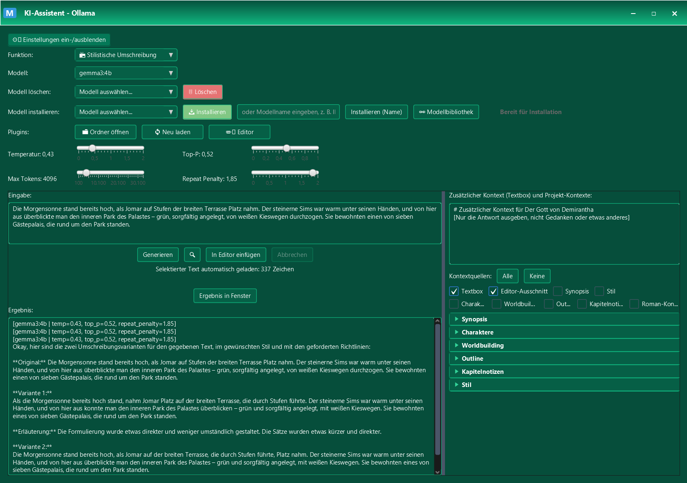

# 📚 Manuskript - Professioneller Text-Editor mit KI-Integration

[](https://openjdk.java.net/)
[](https://openjdk.java.net/javafx/)
[](https://maven.apache.org/)
[](LICENSE)

> **Eine moderne JavaFX-Anwendung für die professionelle Verarbeitung und Bearbeitung von DOCX-Dateien mit integriertem KI-Assistenten und automatischer Text-Bereinigung. Ideal im Zusammenspiel mit Sudowrite**

> [!WARNING]
> I'm sorry, but the program only supports the German language.


*Hauptfenster mit Downloads-Monitor, Datei-Verwaltung und Text-Editor*


## ✨ Highlights

- 🤖 **Lokaler KI-Assistent** mit Ollama-Integration (keine Cloud-Abhängigkeit, Keine Kosten)
- 🎨 **Plugin-System** für erweiterte KI-Funktionen
- 📝 **Vollwertiger Text-Editor** mit Syntax-Highlighting und Themes
- 🔧 **Intelligentes Makro-System** für automatische Text-Bereinigung
- 📥 **Downloads-Monitor** für automatische Sudowrite-Integration
- 🔄 **Diff & Merge-System** für sichere Dokumentenverwaltung
- 📊 **Umfassende Export-Funktionen** (RTF, DOCX, Markdown, HTML, epub, PDF, LaTeX)
- 🎧 **Hörbuch-Erstellung** – Eigener TTS-Editor mit ElevenLabs-API und lokaler KI (ComfyUI/Qwen), ACX-kompatible MP3-Dateien

## 🚀 Schnellstart

### Voraussetzungen
> [!WARNING]
> Zur Zeit ist nur die Windows-Version vollständig lauffähig. Experimente auf anderen Systemen auf eigene Gefahr.


- **Java 17+** ([Download](https://adoptium.net/))
- **Maven 3.6+** ([Download](https://maven.apache.org/download.cgi))
- **Ollama** (optional, für KI-Features)
  - Windows: [Download](https://ollama.com/download/windows)
  - macOS: [Download](https://ollama.com/download/mac)
  - Linux: [Download](https://ollama.com/download/linux)
- **Pandoc** (Für erweiterte Export-Funktionen)
  - Windows: Schon im Projekt enthalten: `pandoc/`)
  - macOS: `brew install pandoc` oder [Download](https://github.com/jgm/pandoc/releases)
  - Linux: `sudo apt install pandoc` (Ubuntu/Debian) oder [Download](https://github.com/jgm/pandoc/releases)
- **MiKTeX oder TeX Live** (optional, für PDF-Export)
  - Windows: [MiKTeX Download](https://miktex.org/download)
  - macOS: [MiKTeX Download](https://miktex.org/download) 
  - Linux: [MiKTeX Download](https://miktex.org/download) 

### Installation & Start

```bash
# 1. Repository klonen
git clone https://codeberg.org/gehackb/Manuskript.git
cd Manuskript

# 2. Abhängigkeiten installieren
mvn clean install

# 3. Anwendung starten (Java 17+ muss im Pfad sein)
mvn javafx:run
```

### Erste Schritte
1. **Erstelle DOCX-Dateien** - DOCX-Dateien, die z.B. aus Sudowrite exportiert wurden
2. **Verzeichnis erstellen** - Hier gehören die docx-Dateien hin 
2. **Verzeichnis auswählen** - Laden Sie das Verzeichnis mit DOCX-Dateien
3. **Dateien auswählen** - Wählen Sie die gewünschten Kapitel aus
4. **Bearbeiten** - Nutzen Sie den Editor für Nachbearbeitung
5. **Exportieren** - Speichern Sie in verschiedenen Formaten. Für einzelne Kapitel oder kompletter Export des Buchs


## 🎯 Kernfunktionen

### 📁 Intelligente Datei-Verwaltung
- **Zwei-Tabellen-Ansicht** - Übersichtliche Datei-Auswahl
- **Drag & Drop** - Einfache Datei-Organisation

### 📥 Downloads-Monitor & Sudowrite-Integration
- **Automatische Überwachung** - Erkennt neue DOCX-Dateien im Downloads-Ordner
- **Intelligente Namenserkennung** - Automatisches Matching mit Projektdateien
- **ZIP-Import** - Direkte Verarbeitung von Sudowrite-Exporten
- **Backup-System** - Sichere Ersetzung mit automatischen Backups

### 📝 Text-Editor
- **Erweiterte Suche** - Regex-Unterstützung mit Such-Historie
- **Keyboard-Shortcuts** - Alle Standard-Editor-Shortcuts
- **Live-Statistiken** - Zeilen-, Wort- und Zeichenzählung
- **Anführungszeichen-Konvertierung** - jederzeit im Editor die Anführungszeichen für den gesamten Text ändern: Französische, Deutsche, Englische und Schweizer Anführungszeichen

### 🔄 Diff & Merge-System
- **Seiten-by-Seiten-Diff** - Importierte DOCX-Dateien können mit den aktuellen Dateien verglichen werden. Detaillierter Vergleich mit Checkbox-Merge

### 🔧 Makro-System
- **"Textbereinung" als default Makro** - Bereinigt viele der häufigen Fehler (Auslassungszeichen, Gedankenstrich, korrekte Absatzformatierung, ...)
- **Vollständig anpassbar** - Eigene Makros erstellen und bearbeiten
- **CSV-Export** - Makros teilen und importieren

### 🤖 KI-Assistent (Ollama)
- **Lokale Ausführung** - Keine Cloud-Abhängigkeit, vollständige Privatsphäre, keine Kosten
- **Streaming-Responses** - Live-Ausgabe während der Generierung
- **Session-Management** - Chat-Historie mit automatischer Speicherung
- **Plugin-System** - Erweiterte Funktionen für spezifische Aufgaben

### 🎨 Plugin-System
- **JSON-basierte Konfiguration** - Einfache Plugin-Erstellung
- **Dynamische Dialoge** - Automatische UI-Generierung für Variablen
- **Text-Integration** - Automatische Verwendung selektierter Texte
- **Kategorisierung** - Organisierte Plugin-Verwaltung

## 📦 Export-Funktionen

| Format | Beschreibung | Formatierung |
|--------|-------------|--------------|
| **RTF** | Rich Text Format | ✅ Vollständig |
| **TXT** | Plain Text | ❌ Nur Text |
| **DOCX** | Microsoft Word | ✅ Vollständig |
| **Markdown** | Markdown-Format | ✅ Strukturiert |
| **HTML5** | Web-Format | ✅ Styling |
| **PDF** | PDF halt | ✅ Styling |
| **LaTeX** | für alle die schon seit 1984 dabei sind | ✅ Styling |
| **epub** | für epub-Viewer | ✅ Styling |

> **Hinweis:** Für den PDF-Export wird **MiKTeX** oder **TeX Live** benötigt. Siehe [Voraussetzungen](#-schnellstart) für plattformspezifische Download-Links (Windows, macOS, Linux).

## 🎧 Hörbuch-Erstellung

Manuskript bringt ein vollständiges Hörbuch-Produktionssystem mit – vom einzelnen Satz bis zur fertigen, ACX-kompatiblen Audiodatei.

### Eigener TTS-Editor
- **Dedizierter Sprachsynthese-Editor** pro Kapitel mit Segment-Verwaltung und integriertem Audio-Player
- **Segmentierung** – Text wird in Absätze oder Sätze aufgeteilt, jedes Segment einzeln generierbar und nachbearbeitbar
- **Stimmen-Lexikon** – Gespeicherte Stimmen (Name, Parameter, Beschreibung) für konsistente Charakterstimmen über das gesamte Buch
- **Tags** – Steuere Aussprache, Pausen und Betonung direkt im Text (ElevenLabs v3 Tags: `<break>`, Aussprachekorrekturen u.v.m.)

### Flexible TTS-Backends
- **ElevenLabs API** – Professionelle Cloud-Stimmen mit ElevenLabs v3-Unterstützung (Tags, Voice Settings, Multilingual)
- **Lokale KI über ComfyUI** – Nutze Qwen3-TTS oder andere Modelle lokal über ComfyUI-Workflows, komplett offline und kostenlos
- **Voice Cloning** – Referenz-Audio für Stimmklone (ComfyUI-Backend)

### ACX-kompatible Hörbuch-Dateien
- **Kapitelweise MP3-Erstellung** – Jedes Kapitel wird als einzelne MP3 exportiert, nummeriert und benannt (`001_Kapitelname.mp3`)
- **Konfigurierbare Bitrate** – 128, 192, 256 oder 320 kbps (CBR) – Standard: 320 kbps
- **Stereo/Mono-Auswahl** – Standard: Stereo (44.1 kHz)
- **Automatisches Trimming** – Vorhandene Stille am Anfang der Segmente wird erkannt und entfernt
- **Normierte Pausen** – 0.8s Stille mit Fade-in am Anfang, 1.5s Stille am Ende jeder Kapitel-Datei
- **Konfigurierbare Segmentpausen** – Einstellbare Pause zwischen den Absätzen innerhalb eines Kapitels
- **FFmpeg-basiert** – Professionelle Audio-Verarbeitung (FFmpeg wird mitgeliefert oder aus dem System-PATH verwendet)

> **Voraussetzungen:** FFmpeg (im Projektverzeichnis `ffmpeg/` oder im System-PATH). Für ElevenLabs: API-Key in der Parameter-Verwaltung. Für lokale TTS: ComfyUI mit entsprechendem TTS-Workflow.

## ⚙️ Konfiguration

### Parameter-Datei (`config/parameters.properties`)
```properties
# UI-Einstellungen
ui.default_theme=4
ui.editor_font_size=16

# Session-Management
session.max_qapairs_per_session=20

# KI-Parameter (Ollama)
ollama.temperature=0.3
ollama.max_tokens=2048
ollama.top_p=0.7
ollama.repeat_penalty=1.3

```

### Textanalyse (`config/textanalysis.properties`) (erweiterbar)
# Sprechwörter für Dialog-Analyse
sprechwörter=sagte,fragte,murmelte,rief,flüsterte,antwortete,erklärte,berichtete,erzählte,bemerkte,kommentierte,stellte fest,behauptete,versicherte,betonte,warnte,vermutete,vermied,gestand ein,zugab,leugnete,versprach,schwor,verhieß,prophezeite,vorhersagte,berichtete,informierte,mitteilte,teilte mit,erzählte von,sprach über,redete von,diskutierte,debattierte,argumentierte,streitete,diskutierte,besprach,besprach sich,unterhielt sich,plauderte,schwatzte,klatschte,tratschte,flüsterte,raunte,brüllte,schrie,heulte,weinte,lachte,grinste,seufzte,stöhnte,ächzte,wimmerte,schluchzte,keuchte,stotterte,stammelte,fluchte,schimpfte,donnerte,knurrte,fauchte,zischte,knurrte,brummte,summte,pfiff,trällerte,sang,deklamierte,rezitierte,sprach,redete,plapperte,schwadronierte,faselte,laberte,quasselte,schwätzte,quatschte,plauderte,unterhielt sich,konversierte,sprach miteinander,redete miteinander

# Regex-Patterns für verschiedene Analysen
sprechantworten_regex=(sagte|fragte|rief|murmelte|flüsterte|antwortete|erklärte|berichtete|erzählte|bemerkte|kommentierte|stellte fest|behauptete|versicherte|betonte|warnte|vermutete|vermied|gestand ein|zugab|leugnete|versprach|schwor|verhieß|prophezeite|vorhersagte|informierte|mitteilte|teilte mit|erzählte von|sprach über|redete von|diskutierte|debattierte|argumentierte|streitete|besprach|besprach sich|unterhielt sich|plauderte|schwatzte|klatschte|tratschte|raunte|brüllte|schrie|heulte|weinte|lachte|grinste|seufzte|stöhnte|ächzte|wimmerte|schluchzte|keuchte|stotterte|stammelte|fluchte|schimpfte|donnerte|knurrte|fauchte|zischte|brummte|summte|pfiff|trällerte|sang|deklamierte|rezitierte|sprach|redete|plapperte|schwadronierte|faselte|laberte|quasselte|schwätzte|quatschte|konversierte|sprach miteinander|redete miteinander)\s+\w+\.

# Weitere Analyse-Patterns können hier hinzugefügt werden
dialog_regex="[^"]*"
direkte_rede_regex"[^"]*"
satz_ende_regex[.!?]+
paragraph_regex\n\s*\n

# Wortwiederholungen-Analyse
wortwiederholungen_abstand=10
wortwiederholungen_min_laenge=4
wortwiederholungen_ignoriere_woerter=der,die,das,und,oder,aber,auch,noch,schon,immer,nie,sehr,ganz,doch,denn,weil,daß,dass,ist,sind,war,waren,hat,haben,hatte,hatten,wird,werden,wurde,wurden,kann,können,konnte,konnten,muss,müssen,musste,mussten,soll,nicht,mich,sollen,sollte,sollten,darf,dürfen,durfte,durften,mag,mögen,mochte,mochten,will,wollen,wollte,wollten,sich,nach,seine,seinem,seinen,ihre,ihrer,ihrem,ihren,eine,einen,einem,dann

# Füllwörter-Analyse
fuellwoerter=eigentlich,irgendwie,halt,mal,ja,nun,also,quasi,sozusagen,gewissermaßen,letztendlich,schlußendlich,im Grunde,im Prinzip,so gesehen

# Phrasen-Analyse
phrasen_begann=begann zu,begann mit,begann es,begann sie,begann er,begannen zu,begannen mit,begannen es,begannen sie,begannen er
phrasen_emotionen=stöhnte,knurrte,seufzte,starrte,lächelte,runzelte die Stirn,schüttelte den Kopf,begann zu,versuchte zu,machte sich auf,fing an zu,setzte sich in Bewegung,warf einen Blick,zog die Stirn kraus,runzelte die Stirn,ließ den Blick schweifen,trat ein,richtete sich auf,holte tief Luft,stockte der Atem
phrasen_dialog=sagte er,sagte sie,fragte er,fragte sie,antwortete er,antwortete sie,erwiderte er,erwiderte sie,flüsterte er,flüsterte sie,rief er,rief sie
phrasen_denken=konnte es nicht fassen,wurde sich bewusst,verstand auf einmal,ahnte dass,fragte sich,erinnerte sich plötzlich,wusste dass etwas nicht stimmte
phrasen_gefuehle=* knie wurden weich,* herz schlug *,* tränen stiegen *,* schweiß brach aus,* kloß im hals,* gänsehaut breitete sich aus,* zorn wallte *
phrasen_bewegung=setzte sich in Bewegung,warf einen Blick,zog die Stirn kraus,runzelte die Stirn,ließ den Blick schweifen,trat ein,richtete sich auf,holte tief Luft,stockte der Atem


## 🤖 KI-Assistent Setup


*Ollama KI-Assistent*

### Ollama installieren
```bash
# Ollama herunterladen und installieren
# Windows: https://ollama.com/download/windows
# macOS: https://ollama.com/download/mac
# Linux: https://ollama.com/download/linux

# Ollama starten
ollama serve
```

### Empfohlene Modelle
```bash
# Schnell und effizient
ollama pull llama3.2:3b

# Für deutsche Texte (empfohlen. Notwendig für das "kritisches Lektorat"-Plugin)
ollama pull jobautomation/OpenEuroLLM-German

# Größeres Modell für bessere Qualität
ollama pull qwen2.5:7b-instruct
```

### Plugin-Beispiele
- **Charakter-Entwicklung** - Detaillierte Charakterprofile
- **Plot-Entwicklung** - Story-Strukturen und Handlungsstränge
- **Grammatik & Stil** - Textverbesserung und Lektorat
- **Kreative Umschreibung** - Alternative Formulierungen
- **Kritisches Lektorat** - Macht Vorschläge, die direkt in den Text übernommen werden können

## ⌨️ Keyboard-Shortcuts

### Text-Editor
| Shortcut | Funktion |
|----------|----------|
| `Ctrl+F` | Suchen/Ersetzen |
| `F3` | Nächstes Suchergebnis |
| `Shift+F3` | Vorheriges Suchergebnis |
| `Ctrl+S` | Speichern |
| `Ctrl+Z` | Rückgängig |
| `Ctrl+Y` | Wiederholen |
| `Ctrl+I` | selektierter Text *kursiv* |
| `Ctrl+B` | selektierter Text **fett** |
| `Ctrl+U` | selektierter Text unterstrichen |
| `Ctrl+D` | Log-files Anzeigen (nur im HauptMenü möglich) |


## 🛠️ Technologien

- **JavaFX 17+** - Moderne Benutzeroberfläche
- **RichTextFX** - Erweiterter Text-Editor
- **Ollama** - Lokale KI-Integration (Text)
- **ElevenLabs API** - Cloud-basierte Sprachsynthese (teuer, aber schweinegut)
- **ComfyUI + Qwen TTS** - Lokale Sprachsynthese (offline, kostenlos)
- **FFmpeg** - Audio-Verarbeitung und Hörbuch-Erstellung
- **Language tool** - Lokale Rechtschreibkorrektur
- **Maven** - Build-Management
- **SLF4J/Logback** - Logging-System

## 🐛 Troubleshooting


## 📈 Roadmap


### Bekannte Einschränkungen
- Ollama benötigt ausreichend Speicher und kräftige Grafikkarte (mind. 12GB / >= GTX4070 empfohlen)

## 🤝 Beitragen

Wir freuen uns über Beiträge! So können Sie helfen:

1. **Fork** das Repository
2. **Branch** erstellen (`git checkout -b feature/AmazingFeature`)
3. **Änderungen** committen (`git commit -m 'Add AmazingFeature'`)
4. **Push** zum Branch (`git push origin feature/AmazingFeature`)
5. **Pull Request** erstellen

### Entwicklungsumgebung einrichten
```bash
# IDE, maven und Java >= 17 installieren 
# Repository klonen
git clone https://codeberg.org/gehackb/Manuskript.git
cd Manuskript

# Maven-Abhängigkeiten installieren
mvn clean install

# IDE-Import (IntelliJ IDEA empfohlen)
# File → Open → Manuskript-Ordner auswählen
```

## 📄 Lizenz

Dieses Projekt steht unter der **MIT-Lizenz**. Siehe [LICENSE](LICENSE) für Details.

## 📞 Support

- **Issues** - [GitHub Issues](https://codeberg.org/gehackb/Manuskript/issues)
- **Diskussionen** - [GitHub Discussions](https://codeberg.org/gehackb/Manuskript/discussions)
- **Wiki** - [Projekt-Wiki](https://codeberg.org/gehackb/Manuskript/wiki)

---

**Entwickelt für Autoren, die professionelle Manuskripte erstellen möchten.** 📚✨

*Keine Cloud-Abhängigkeit • Vollständige Privatsphäre • Lokale Ausführung*
