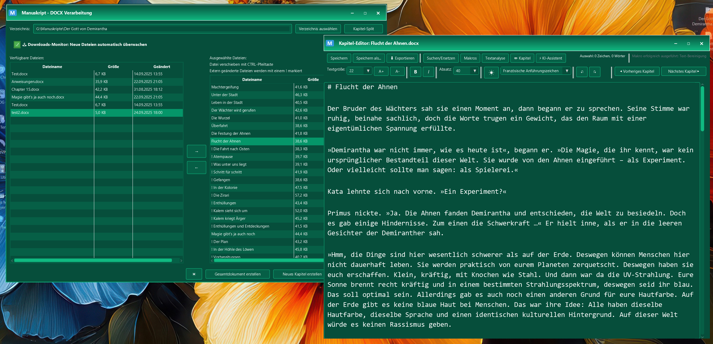

# Manuskript – Roman- und Buchproduktion mit Markdown-Editor

[](https://openjdk.java.net/)
[](https://openjdk.java.net/javafx/)
[](https://maven.apache.org/)
[](LICENSE)

> **JavaFX-Desktopanwendung für die professionelle Bearbeitung von DOCX-Kapiteln als Markdown – mit Agenten, Online-Lektorat, Export und Hörbuch-Produktion. Ideal im Zusammenspiel mit Sudowrite.**

> **Hinweis:** Die Benutzeroberfläche ist derzeit nur auf Deutsch verfügbar.


*Hauptfenster mit Projektverwaltung, Kapitelauswahl und Toolbar*

## Highlights

- **Canvas-Kapitel-Editor** – Markdown mit Inline-Darstellung, „Markdown ausblenden“, Suche/Ersetzen, Zeilennummern
- **Agenten-Panel** – Analyse (Plothole, Dialog, Stil), Szene schreiben, Chat, Überarbeiten per Selektion
- **Online-Lektorat** – Kapitelweises Lektorat über OpenAI-kompatible API
- **Welt-Editor** – Projekt-Kontextdateien (Charaktere, Outline, Worldbuilding, …) mit KI-Generierung
- **Roman-Assistent** – Interaktive Romanplanung mit KI und Session-Fortsetzung
- **Makro-System** – Automatische Textbereinigung (Anführungszeichen, Gedankenstriche, Absätze)
- **Textanalyse** – Füllwörter, Phrasen, Wortwiederholungen, Sprechantworten
- **Downloads-Monitor** – Sudowrite-Integration mit automatischem DOCX-Import
- **Export** – RTF, DOCX, Markdown, HTML, EPUB, PDF, LaTeX
- **Hörbuch-Erstellung** – TTS-Editor mit ElevenLabs und lokaler KI (ComfyUI/Qwen), ACX-kompatible MP3

## Schnellstart

### Voraussetzungen

> **Warnung:** Zur Zeit ist nur die Mac-Version vollständig getestet. Experimente auf anderen Systemen auf eigene Gefahr.

- **Java 21+** ([Download](https://adoptium.net/))
- **Maven 3.8+** ([Download](https://maven.apache.org/download.cgi))
- **Pandoc** (Export) – unter Windows im Projekt unter `pandoc/` enthalten
- **Optional – Agenten (lokal):** [Ollama](https://ollama.com) als Backend (`agent.ollama.*`)
- **Optional – Agenten & Lektorat (Cloud):** OpenAI-kompatibler API-Key (`agent.openai.*`, `api.lektorat.*`)
- **Optional – Rechtschreibung:** LanguageTool (localhost:8081)
- **Optional – PDF:** MiKTeX oder TeX Live
- **Optional – Hörbuch:** FFmpeg (im Projekt unter `ffmpeg/` oder im PATH)

### Installation & Start

```bash
git clone https://codeberg.org/gehackb/Manuskript.git
cd Manuskript
mvn clean install
mvn javafx:run
```

> **Hinweis:** `mvn compile` aktualisiert nur `target/classes`. Für JAR/App-Image zuerst `mvn package` ausführen.

### Erste Schritte

1. Projektverzeichnis mit DOCX-Kapiteln wählen (oder Roman-Assistent für ein neues Projekt nutzen)
2. Kapitel in die rechte Tabelle legen und sortieren
3. **Kapitel bearbeiten** – öffnet den Canvas-Editor
4. Optional: Agenten, Online-Lektorat, Makros, Textanalyse
5. Buch exportieren oder Hörbuch erzeugen

## Kernfunktionen

### Datei-Verwaltung

- Zwei-Tabellen-Ansicht (verfügbar / im Buch)
- Drag & Drop, Kapitel-Reihenfolge = Buchreihenfolge
- Diff & Merge beim Import neuer DOCX-Versionen

### Kapitel-Editor (Canvas)

Der Editor arbeitet intern mit Markdown; Formatierung über Toolbar-Buttons und Tastenkürzel.

- **Markdown-Toolbar:** Fett, Kursiv, Überschriften, Listen, Tabellen, Code, Links, Undo/Redo
- **„Markdown ausblenden“:** Formatierung wird inline dargestellt, Syntaxzeichen werden ausgeblendet
- **Host-Toolbar:** Zeilennummern, Mark/Zitat/Farbe, Anführungszeichen-Stil, LanguageTool
- **Werkzeuge:** Szenen-Outline, Textanalyse, Agenten-Panel, Online-Lektorat, Makros, Bilder
- **Speichern:** Markdown-Kopie im `data`-Verzeichnis; Diff bei ungespeicherten Änderungen

Ausführliche Hilfe: im Editor über die Hilfe-Buttons (?).

### Agenten & Online-Lektorat

**Agenten** (rechtes Panel im Editor):

- Analyse-Agenten (Plotlöcher, Dialog, Textstruktur, Show-don't-tell, …)
- Szene-schreiben-Agent mit Anweisungsfeld und Szenen-Kontext
- Chatbot mit Projektkontext
- Überarbeiten per Kontextmenü auf markiertem Text
- Konfiguration in `config/agents.json` und pro Tab; Backend Ollama oder OpenAI

**Online-Lektorat** (Toolbar „Lektorat“):

- Ganzes Kapitel in Abschnitten an API senden
- Vorschläge im rechten Panel übernehmen oder ablehnen
- Parameter unter **Online-Lektorat** (`api.lektorat.*`)

### Welt-Editor & Roman-Assistent

- **Welt-Editor:** Bearbeitet `characters.txt`, `outline.txt`, `worldbuilding.txt` usw. im Projektordner; KI-Generierung und Extraktion aus Kapiteln
- **Roman-Assistent:** Geführte Planungsphasen mit KI; Session wird im Projekt gespeichert und kann fortgesetzt werden

### Downloads-Monitor & Sudowrite

- Überwacht den Downloads-Ordner auf neue DOCX/ZIP-Dateien
- Automatisches Matching und sicheres Ersetzen mit Backup

### Makros & Textanalyse

- Standard-Makro „Textbereinigung“ für typische Formatfehler
- Textanalyse: Füllwörter, Phrasen, Wortwiederholungen (konfigurierbar in `config/textanalysis.properties`)

## Export-Funktionen

| Format | Beschreibung | Formatierung |
|--------|-------------|--------------|
| **RTF** | Rich Text Format | Vollständig |
| **TXT** | Plain Text | Nur Text |
| **DOCX** | Microsoft Word | Vollständig |
| **Markdown** | Markdown | Strukturiert |
| **HTML5** | Web | Styling |
| **PDF** | PDF | Styling (MiKTeX/TeX Live) |
| **LaTeX** | LaTeX | Styling |
| **EPUB** | E-Book | Styling |

## Hörbuch-Erstellung

- Dedizierter TTS-Editor pro Kapitel mit Segment-Verwaltung
- **ElevenLabs API** oder **lokale KI über ComfyUI** (z. B. Qwen3-TTS)
- ACX-kompatible MP3-Exporte pro Kapitel (`001_Kapitelname.mp3`)
- FFmpeg-basierte Nachbearbeitung (Trimmen, Pausen, Bitrate)

## Konfiguration

Wichtige Parameter (über **Parameter**-Dialog oder `config/parameters.properties`):

```properties
# Agenten
agent.enabled=true
agent.backend=Ollama
agent.ollama.api_url=http://localhost:11434
agent.ollama.model=gemma3:4b
agent.openai.api_key=
agent.openai.model=gpt-4o-mini

# Online-Lektorat
api.lektorat.api_key=
api.lektorat.base_url=https://api.openai.com/v1
api.lektorat.model=gpt-4o-mini
api.lektorat.type=allgemein

# UI
ui.editor_font_size=16
main_window_theme=0
```

Agenten-Definitionen: `config/agents.json`

## Tastenkürzel (Hauptfenster)

| Kürzel | Funktion           |
|--------|--------------------|
| Strg+D | Debug Window       |
| Strg+R | Restore Windows    |


## Tastenkürzel (Editor)

| Kürzel | Funktion |
|--------|----------|
| Strg+S | Speichern |
| Strg+F | Suchen |
| Strg+H | Ersetzen |
| Strg+Z / Strg+Y | Rückgängig / Wiederholen |
| Strg+B / Strg+I | Fett / Kursiv |
| Strg+M | Markdown-Hilfe |
| Strg+Pfeil links/rechts | Vorheriges/nächstes Kapitel |

## Technologien

- **JavaFX 21** – Benutzeroberfläche
- **Canvas-Editor** (`ManuskriptTextEditor` / `MdTextArea`) – Markdown-Bearbeitung
- **Ollama / OpenAI-kompatible APIs** – Agenten und Lektorat
- **LanguageTool** – Rechtschreibprüfung
- **ElevenLabs / ComfyUI** – Sprachsynthese
- **FFmpeg** – Audio
- **Maven** – Build

## Entwicklung

```bash
mvn compile
mvn test
mvn javafx:run
```

Siehe auch `AGENTS.md` für Hinweise zur aktiven Codebasis (Canvas-Editor als Standard).

## Lizenz

MIT – siehe [LICENSE](LICENSE)

## Support

- [Issues](https://codeberg.org/gehackb/Manuskript/issues)
- [Diskussionen](https://codeberg.org/gehackb/Manuskript/discussions)

---

**Für Autoren, die Manuskripte professionell von der Kapiteldatei bis zum Export oder Hörbuch bearbeiten möchten.**
