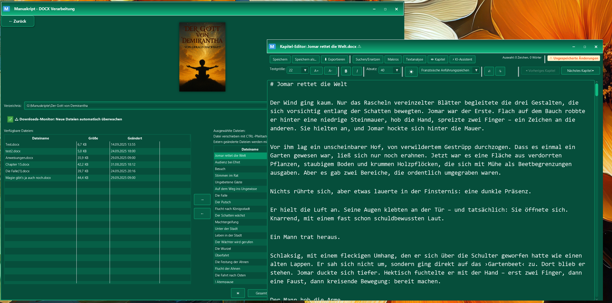

# Manuskript - DOCX Verarbeitung & Text-Editor

**Hauptzweck:** JavaFX-Anwendung zum Zusammenführen mehrerer DOCX-Dateien  zu einem Manuskript mit integriertem Text-Editor und automatischer Nachbearbeitung. Gut geeignet z.B. für **Sudowrite** Projekt-Exporte. Ein Split eines .docx in Kapitel ist auch möglich. 

Eine moderne JavaFX-Anwendung zur Verarbeitung und automatischen und mauellen Nachbearbeitung von DOCX-Dateien zu einem zusammenhängenden Textdokument mit professionellem Text-Editor. Findet und behebt typische Fehler: Auslassungszeichen, Zeichensetzungsfehler, Leerzeilen und -zeichen, findet Füllwörter, Phrasen, lokaler KI-Assistent [ollama]
Grammatikprüfungen, Lektorat, ein chatbot ... alles inklusive. 
Das Ganze kostet nix und telefoniert nicht nachhause. 

## ⚡ Schnellstart

Voraussetzungen: Java 17+, Maven 3.6+, für den KI-Assistenten eine kräftige Grafikkarte und ordentlich RAM.

```bash
# Abhängigkeiten bauen
mvn clean install
# Anwendung starten
mvn javafx:run
```


*Manuskript Hauptfenster mit Downloads-Monitor, Datei-Verwaltung und Text-Editor*

Erste Schritte:
- Verzeichnis mit DOCX-Dateien wählen
- Dateien filtern/auswählen und „Ausgewählte verarbeiten" klicken
- Ergebnis im Editor prüfen, optional Makros anwenden und exportieren

### 🤖 KI-Assistent (optional) – Schnellstart

Voraussetzung: Ollama installieren. Kann vom Programm aus gestartet werden (siehe [Ollama-Website](https://ollama.com)).

```bash
# Beispielmodell laden
ollama pull llama3.2:3b
# Dienst (falls nötig) starten
ollama serve
```

In der Anwendung:
- Button „🤖 KI-Assistent“ öffnen
- Modell auswählen und Verbindung prüfen
- Prompt eingeben und Antwort generieren

Hinweis: Sessions und Parameter werden unter `config/` gespeichert; Details im Abschnitt „KI-Assistent (Ollama)“ unten.

Bestes Modeel zurzeit auf Ollama für kreatives scheiben auf Deutsch: jobautomation/OpenEuroLLM-German 
Einfach in "Modell installieren" eintragen oder:

```cmd
ollama run jobautomation/OpenEuroLLM-German
```

## 🎯 Kernfunktionen

### 📁 Datei-Verwaltung
- **Verzeichnis-Auswahl:** Verzeichnis mit DOCX-Dateien laden
- **Zwei-Tabellen-Ansicht:** Verfügbare Dateien links, ausgewählte Dateien rechts
- **📥 Downloads-Monitor (neu):** Automatische Überwachung des Downloads-Verzeichnisses auf neue DOCX-Dateien mit intelligenter Namenserkennung und Backup-System. Ideal für Sudowrite exports.
- **📦 Sudowrite ZIP-Import:** Automatische Erkennung und Entpackung von Sudowrite ZIP-Exporten mit Projektnamen-Matching und automatischer DOCX-Integration.

### 📝 Text-Editor
- **Vollwertiger Editor:** Highlighting, Zeilennummern, Themes
- **Such- und Ersetzungsfunktionen:** Mit Regex-Unterstützung und Historie
- **Datei-Operationen:** Öffnen, Speichern, Speichern als
- **Export-Funktionen:** RTF/DOCX, Markdown, RTF, HTML, TXT
- **Keyboard-Shortcuts:** die üblichen Tastenkombinationen
- **Diff & Merge: ** Seiten-by-Seiten-Diff bei extern geänderter DOCX mit Auswahl-Übernahme per Checkboxen (nur ins Sidecar, niemals in die DOCX).
- **Sicheres Speichern: ** Speicherdialog mit klaren Optionen (Sidecar speichern, DOCX überschreiben, Diff anzeigen, Abbrechen). 
- **Automatische MD-Erstellung:** MD-Dateien werden automatisch beim ersten Editor-Aufruf angelegt
- **Intelligente Änderungserkennung:** Hash-basierte Erkennung von DOCX-Änderungen mit korrektem "!" Status-Management

### 🔧 Makro-System
- **Automatische Text-Bereinigung:** 13 vordefinierte Schritte
- **Anführungszeichen-Konvertierung:** Französische ↔ Deutsche Anführungszeichen
- **Apostrophe-Korrektur:** Verschiedene Apostrophe-Formen korrigieren
- **Vollständig anpassbar:** Eigene Makros erstellen und bearbeiten
- **CSV-Export:** Makros können exportiert und geteilt werden

## 🚀 Funktionen im Detail

### Datei-Verarbeitung
- **DOCX-Extraktion:** Konvertiert DOCX-Dateien in lesbaren Text
- **Regex-Filterung:** Erweiterte Filterung mit regulären Ausdrücken
- **Verzeichnis-Memory:** Letztes Verzeichnis wird automatisch gespeichert
- **Mehrfachauswahl:** Einzelne oder alle Dateien zur Verarbeitung auswählen

### Text-Editor Features
- **Theme-System:** Hell/Dunkel-Modi und weitere Themes
- **Font-Größe:** Dynamische Schriftgrößen-Anpassung
- **Formatierung:** Fett, Kursiv und weitere Formatierungen
- **Undo/Redo:** Vollständige Rückgängig-Funktion
- **Status-Anzeige:** Zeilen, Wörter, Zeichen zählen
- **Export-Funktionen:** 
  - **RTF:** Nur für Markdown-Dokumente (mit Formatierung)
  - **DOCX:** Nur für Markdown-Dokumente (mit Formatierung)
  - **Markdown, HTML, TXT:** Für alle Formate

### Such- und Ersetzungsfunktionen
- **Regex-Unterstützung:** Erweiterte Suche mit regulären Ausdrücken
- **Such-Historie:** Letzte 20 Such- und Ersetzungs-Patterns
- **Pattern-Speicherung:** Such- und Ersetzungs-Patterns können gespeichert werden
- **Optionen:** Case-Sensitive, Ganzes Wort, Regex
- **Navigation:** Vor/Zurück durch Suchergebnisse
- **Ersetzen:** Einzeln oder Alle ersetzen

### Makro-System
- **Text-Bereinigung:** 18 Schritte zur professionellen Nachbearbeitung
- **Anführungszeichen:** Französische ↔ Deutsche Konvertierung
- **Apostrophe:** Korrektur verschiedener Apostrophe-Formen
- **Makro-Editor:** Übersichtliche Verwaltung und Bearbeitung
- **Schritt-für-Schritt:** Einzelne Schritte aktivieren/deaktivieren

## 📦 Voraussetzungen

- **Java:** 17 oder höher
- **Maven:** 3.6 oder höher
- **Betriebssystem:** Windows, macOS, Linux

## 🛠️ Installation und Ausführung

### 1. Projekt klonen
```bash
git clone https://github.com/geraldHack/Manuskript.git
cd Manuskript
```

### 2. Maven-Abhängigkeiten installieren
```bash
mvn clean install
```

### 3. Anwendung starten
```bash
mvn javafx:run
```

## ⚙️ Externe Konfiguration (config/)

- Der Ordner `config/` wird beim ersten Start automatisch angelegt und enthält:
  - `config/css/styles.css`, `config/css/editor.css` für anpassbares Styling
  - `config/parameters.properties` für UI-, Session- und KI-Parameter
  - `config/textanalysis.properties` für Textanalyse-Listen
  - `config/sessions/*.json` für gespeicherte Chat-Sessions des KI-Assistenten
- Wichtige Schlüssel in `parameters.properties`:
  - `session.max_qapairs_per_session`
  - `ollama.temperature`, `ollama.max_tokens`, `ollama.top_p`, `ollama.repeat_penalty`


```properties
# UI
ui.default_theme=4
ui.editor_font_size=16

# Session
session.max_qapairs_per_session=20

# KI (Ollama)
ollama.temperature=0.3
ollama.max_tokens=2048
ollama.top_p=0.7
ollama.repeat_penalty=1.3
```

## 📖 Verwendung

### Schritt 1: Verzeichnis auswählen
1. Klicken Sie auf "Verzeichnis auswählen"
2. Wählen Sie ein Verzeichnis mit DOCX-Dateien
3. Das letzte Verzeichnis wird automatisch vorgeschlagen

### Schritt 2: Dateien filtern und auswählen
1. **Dateien auswählen:** Drag & Drop zwischen den Tabellen
2. **Sortierung:** In der rechten Tabelle können Dateien mit CTRL-Cursortasten verschoben werden


### Schritt 3: Text bearbeiten
1. **Suchen/Ersetzen:** Ctrl+F oder Button "Suchen/Ersetzen"
2. **Makros anwenden:** Button "Makros" für automatische Bereinigung
3. **Datei speichern:** Ctrl+S oder Button "Speichern"
4. **Exportieren:** 
   - **RTF:** 
   - **DOCX:** 
   - **Markdown, HTML, TXT:** 
   
## 🤖 KI-Assistent (Ollama)

- Lokaler KI-Assistent mit Chat-Historie, Sessions und konfigurierbaren Parametern.
- Start im Editor über den Button „🤖 KI-Assistent“. Fensterposition/-größe werden gespeichert.
- Voraussetzungen:
  - Installiere Ollama (siehe [Ollama-Website](https://ollama.com)) und starte den Dienst.
  - Modelle können im KI-Fenster installiert, gelöscht und gelistet werden.
- Kontext & Sessions:
  - Session-Verläufe werden unter `config/sessions/<name>.json` gespeichert.
  - Lange Verläufe werden bei `session.max_qapairs_per_session` automatisch aufgeteilt.
- Streaming & UX (neu):
  - Echte Streaming-Fortschrittsanzeige während der Generierung.
  - Automatisches Scrollen ans Ende im normalen Ausgabefenster während des Streamings.
  - Stabile Persistenz: Antworten werden am Ende zuverlässig gespeichert; laufende Antworten werden live in die aktuelle Q&A-Zeile geschrieben.
- Parameter:
  - Standardwerte kommen aus `parameters.properties`; Änderungen über die UI werden persistiert.
  - Bei nicht erreichbarem Dienst wird ein Hinweisdialog gezeigt, Generieren schlägt andernfalls fehl.

### Empfohlene Modelle & Parameter

Schnellstart-Modelle (lokal, ressourcenschonend bis mittel):
- `llama3.2:3b` (Allround, schnell)
- `phi3:3.8b-mini-instruct` (kompakt, solide Antworten)
- `qwen2.5:7b-instruct` (größer, bessere Qualität)


Empfohlene Startparameter (werden in `config/parameters.properties` gespeichert):
```properties
# KI (Ollama)
ollama.temperature=0.3
ollama.max_tokens=2048
ollama.top_p=0.7
ollama.repeat_penalty=1.3
```

Hinweise:
- Niedrigere `temperature` = präzisere, konsistentere Antworten.
- Erhöhe `max_tokens`, wenn Antworten gekürzt werden sollen.
- `repeat_penalty` leicht > 1.0 gegen Wiederholungen.

### Troubleshooting KI (Ollama)
- **Dienst nicht erreichbar**: Läuft Ollama?
  - Prüfen: `curl http://127.0.0.1:11434/api/tags`
  - Starten: `ollama serve`
- **Modell nicht gefunden**: Gewünschtes Modell per `ollama pull <name>` laden und in der UI auswählen.
- **Langsam/Abbruch**: Größeres Modell gewählt? Wechsel auf kleineres (z. B. `llama3.2:3b`).
- **Windows/WSL**: Stelle sicher, dass Ollama im selben Kontext läuft, in dem die App zugreift (Host vs. WSL). Notfalls 127.0.0.1 verwenden.
- **Firewall/Proxy**: Lokale Verbindungen auf Port 11434 erlauben.

### Screenshot

*KI-Assistent Fenster mit Chat-Historie, Modell-Auswahl und Streaming-Ausgabe*

## 📥 Downloads-Monitor

Der Downloads-Monitor überwacht automatisch Ihr Downloads-Verzeichnis auf neue DOCX-Dateien und ersetzt passende Dateien in Ihrem Projektverzeichnis.

### Funktionsweise
- **Automatische Überwachung:** Prüft alle 5 Sekunden das Downloads-Verzeichnis
- **Intelligente Namenserkennung:** Vergleicht Dateinamen (ohne Erweiterung) mit vorhandenen DOCX-Dateien
- **Sichere Ersetzung:** Erstellt automatisch Backups der ursprünglichen Dateien
- **Zwei Modi:**
  - **Namensvergleich:** Ersetzt nur passende Dateien
  - **Alle DOCX kopieren:** Kopiert alle DOCX-Dateien ohne Namensvergleich

### 📦 Sudowrite ZIP-Import
- **Automatische ZIP-Erkennung:** Erkennt ZIP-Dateien mit Projektnamen-Matching
- **Intelligente Entpackung:** Entpackt DOCX-Dateien direkt ins Projektverzeichnis
- **Projektname-Matching:** ZIP-Dateien werden erkannt, wenn der Name mit dem Projektverzeichnis übereinstimmt
- **Automatische Integration:** Entpackte DOCX-Dateien werden automatisch in die Projektdatei-Liste integriert
- **ZIP-Bereinigung:** Original ZIP-Datei wird nach erfolgreichem Import automatisch gelöscht

### Aktivierung
1. **Checkbox aktivieren:** "📥 Downloads-Monitor: Neue Dateien automatisch überwachen"
2. **Downloads-Verzeichnis wählen:** Dialog erscheint beim ersten Aktivieren
3. **Optionen konfigurieren:** 
   - Standard: Namensvergleich und Ersetzung
   - "Alle DOCX kopieren": Kopiert alle DOCX-Dateien ohne Namensvergleich
4. **Automatischer Start:** Monitor läuft im Hintergrund

### Backup-System
- **Automatische Backups:** Ersetzte Dateien werden in `backup/` gespeichert
- **Zeitstempel:** Backup-Dateien erhalten Datum/Zeit-Suffix
- **Sichere Ersetzung:** Original wird erst nach erfolgreichem Backup ersetzt

### Konfiguration
Einstellungen werden in `config/parameters.properties` gespeichert:
```properties
# Downloads-Monitor
downloads_directory=C:\Users\Benutzer\Downloads
backup_directory=G:\workspace\Manuskript\backup
copy_all_docx=false
```

### Beispiel-Workflow

#### Standard DOCX-Import
1. **Datei herunterladen:** Neue DOCX-Datei erscheint im Downloads-Verzeichnis
2. **Automatische Erkennung:** Monitor erkennt die neue Datei
3. **Namensvergleich:** Sucht nach passender Datei im Projektverzeichnis
4. **Backup erstellen:** Original-Datei wird als Backup gesichert
5. **Ersetzung:** Neue Datei ersetzt die Original-Datei
6. **UI-Aktualisierung:** Datei-Liste wird automatisch aktualisiert

#### Sudowrite ZIP-Import
1. **Sudowrite Export:** "Export as xx docs" in Sudowrite ausführen
2. **ZIP-Download:** ZIP-Datei erscheint im Downloads-Verzeichnis (z.B. "Mein_Projekt.zip")
3. **Projektname-Matching:** Monitor erkennt ZIP mit Projektnamen
4. **Automatische Entpackung:** ZIP wird entpackt, DOCX-Dateien ins Projekt kopiert
5. **ZIP-Bereinigung:** Original ZIP wird automatisch gelöscht
6. **Projekt-Integration:** Neue DOCX-Dateien werden automatisch in die Projektdatei-Liste integriert

## 🧩 Textanalyse-Konfiguration

- Datei: `config/textanalysis.properties`
- Enthält Listen (Füllwörter, Sprechwörter, Phrasen); änderbar ohne Rebuild.

Beispiel `config/textanalysis.properties`:

```properties
# Füllwörter
fuellwoerter=und,oder,aber,auch,noch,schon,erst,denn,dann,so,wie,als,dass,da,wo,was,wer

# Sprechwörter
sprechwoerter=sagte,sprach,erzählte,berichtete,erklärte,antwortete,fragte,meinte,dachte

# Phrasen
phrasen=es war einmal,in der tat,wie gesagt,wie bereits erwähnt
```

## 🗂️ Kapitel-Editor

- Im Editor blendet der Button „📝 Kapitel“ einen Bereich für Kapitelbeschreibung und Szenen/Notizen ein.
- Inhalte werden mit dem Projektkontext konsistent gehalten.

## 🎨 Themes & Styling überschreiben

- Eigene Styles in `config/css/styles.css` und `config/css/editor.css` ablegen.
- Fehlen die Dateien, erzeugt die Anwendung Defaults und lädt sie automatisch.

## 🛠️ Troubleshooting

- JavaFX startet nicht: Projekt-SDK auf JDK 17 stellen (IDE-Einstellungen).
- Ollama-Fehler: Läuft der Dienst? Modell vorhanden? Firewall/Proxy prüfen. `parameters.properties` prüfen.
- Styles greifen nicht: Existieren `config/css/*.css`? Anwendung neu starten.
- Diff/Merge erscheint nicht: Externe Änderungen werden beim Öffnen des Kapitels erkannt; alternativ im Editor „Diff anzeigen“ nutzen.
- Leere Antworten in Chat-Historie: Beim Stream-Abbruch werden unvollständige Antworten nicht gespeichert. Mit der Live-Aktualisierung sollten keine leeren Einträge mehr entstehen.

## 🔍 Regex-Filterung

### Beispiele für Datei-Filterung
- `*[0-9][0-9]*` - Dateien mit zwei aufeinanderfolgenden Ziffern
- `.*kapitel.*` - Dateien mit "kapitel" im Namen (case-insensitive)
- `^[A-Z].*` - Dateien, die mit einem Großbuchstaben beginnen
- `[0-9]{2,3}` - Dateien mit 2-3 Ziffern

### Beispiele für Text-Suche
- `\b[A-Z][a-z]+` - Wörter, die mit Großbuchstaben beginnen
- `[.!?]{2,}` - Mehrfache Satzzeichen
- `\s{2,}` - Mehrfache Leerzeichen
- `[""''„"‚']` - Verschiedene Anführungszeichen

## 🎨 Makro-System

### Vordefinierte Makros

#### Text-Bereinigung (13 Schritte)
1. Mehrfache Leerzeichen reduzieren
2. Mehrfache Leerzeilen reduzieren
3. Gerade Anführungszeichen öffnen
4. Gerade Anführungszeichen schließen
5. Komma vor Anführungszeichen I
6. Einfache Anführungszeichen Französisch
7. Anführungszeichen Französisch
8. Auslassungszeichen
9. Buchstabe direkt an Auslassungszeichen
10. Buchstabe direkt nach Auslassungszeichen
11. Gedankenstrich
12. Komma vor Anführungszeichen
13. Einfache Anführungszeichen Französisch

#### Französische → Deutsche Anführungszeichen (2 Schritte)
1. Französische zu deutsche Anführungszeichen
2. Französische zu deutsche einfache Anführungszeichen

#### Apostrophe korrigieren (4 Schritte)
1. Apostrophe zwischen Buchstaben korrigieren
2. Grave-Akzent zu Apostrophe
3. Akut-Akzent zu Apostrophe
4. Typografisches Apostrophe korrigieren

### Makro-Verwaltung
- **Makros erstellen:** Eigene Makros mit benutzerdefinierten Schritten
- **Schritte bearbeiten:** Einzelne Schritte anpassen oder löschen
- **Schritte verschieben:** Reihenfolge mit Drag & Drop ändern
- **CSV-Export:** Makros können exportiert und geteilt werden

## ⌨️ Keyboard-Shortcuts

### Text-Editor
- `Ctrl+F` - Suchen/Ersetzen-Panel öffnen/schließen
- `F3` - Nächstes Suchergebnis
- `Shift+F3` - Vorheriges Suchergebnis
- `Ctrl+S` - Speichern
- `Ctrl+O` - Datei öffnen
- `Ctrl+N` - Neue Datei
- `Ctrl+Z` - Rückgängig
- `Ctrl+Y` - Wiederholen

### Makros
- **Button "Makros"** - Makro-Panel öffnen/schließen
- **Button "Makro ausführen"** - Aktuelles Makro ausführen

## 🏗️ Projektstruktur

```
src/main/java/com/manuskript/
├── Main.java
├── MainController.java
├── EditorWindow.java
├── DocxFile.java
├── DocxProcessor.java
├── Macro.java
├── MacroStep.java
├── OllamaWindow.java         # KI-Assistent UI
├── OllamaService.java        # Kommunikation mit Ollama
├── CustomChatArea.java       # Chat-UI mit Q/A-Verwaltung
├── NovelManager.java         # Kontextdateien/Gliederung
└── ResourceManager.java      # Config/CSS/Sessions-Handling

src/main/resources/
├── fxml/
│   ├── main.fxml
│   └── editor.fxml
├── css/
│   ├── styles.css
│   └── editor.css
└── logback.xml

config/
├── css/
│   ├── styles.css
│   └── editor.css
├── parameters.properties
├── textanalysis.properties
└── sessions/
    └── <name>.json
```

## 🛠️ Technologien

- **JavaFX:** Moderne Benutzeroberfläche
- **Apache POI:** DOCX-Datei-Verarbeitung
- **RichTextFX:** Erweiterter Text-Editor
- **Maven:** Build-Management
- **SLF4J/Logback:** Logging
- **Java Preferences API:** Einstellungen speichern

## 📝 Changelog

### Version 1.0 (Aktuell)
- ✅ Vollwertiger Text-Editor mit Syntax-Highlighting
- ✅ Makro-System für automatische Text-Bereinigung
- ✅ Drag & Drop Datei-Verwaltung
- ✅ Regex-Filterung und -Suche
- ✅ Theme-System (Hell/Dunkel)
- ✅ Export-Funktionen (RTF/DOCX nur für Markdown, Markdown, HTML, TXT)
- ✅ Keyboard-Shortcuts
- ✅ Undo/Redo-System
- ✅ Cursor-Navigation in Makro-Tabelle
- ✅ Pattern-Speicherung für Such- und Ersetzungs-Patterns

#### Neu hinzugekommen
- 🔐 Hash-basierte Erkennung externer DOCX-Änderungen (CRC32) mit Banner/Popup „DOCX extern geändert".
- 🧩 Seiten-by-Seiten-Diff mit Checkbox-Merge – Auswahl wird ausschließlich ins Sidecar übernommen, mit Backup im `.history/`-Ordner.
- 💾 Überarbeitetes Speichern: Klarer Dialog, sicherer Sidecar-Only-Write, „Silent Save" bei Navigation.
- 📡 KI-Streaming mit Live-Progress und Autoscroll im Ausgabefenster.
- 💬 Chat-Sessions: Zuverlässige Speicherung abgeschlossener Antworten; automatische Session-Splitting.
- 📥 Downloads-Monitor: Automatische Überwachung des Downloads-Verzeichnisses mit intelligenter Namenserkennung, Backup-System und zwei Modi (Namensvergleich / Alle DOCX kopieren).
- 📦 Sudowrite ZIP-Import: Automatische Erkennung und Entpackung von Sudowrite ZIP-Exporten mit Projektnamen-Matching, automatischer DOCX-Integration und ZIP-Bereinigung.

## 🤝 Beitragen

1. Fork das Repository
2. Erstelle einen Feature-Branch (`git checkout -b feature/AmazingFeature`)
3. Committe deine Änderungen (`git commit -m 'Add some AmazingFeature'`)
4. Push zum Branch (`git push origin feature/AmazingFeature`)
5. Öffne einen Pull Request

## 📄 Lizenz

Dieses Projekt steht unter der MIT-Lizenz. Siehe die [LICENSE](LICENSE) Datei für Details.

## 🙏 Danksagungen

- **Apache POI** für DOCX-Verarbeitung
- **RichTextFX** für den erweiterten Text-Editor
- **JavaFX** für die moderne Benutzeroberfläche
- **Maven** für das Build-Management

---

**Entwickelt für Autoren, die mehrere DOCX-Kapitel zu einem professionellen Manuskript zusammenführen möchten.** 📚✨
