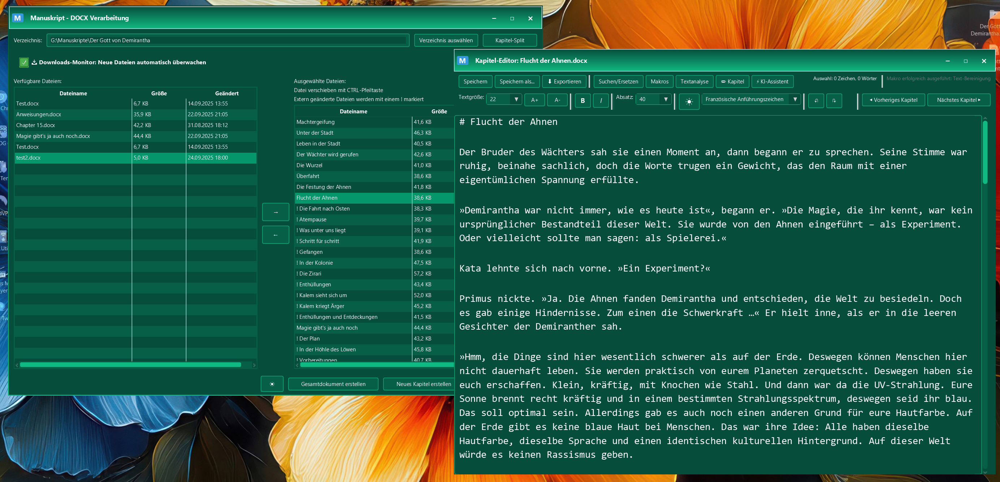

# 📚 Manuskript - Professioneller Text-Editor mit KI-Integration

[](https://openjdk.java.net/)
[](https://openjdk.java.net/javafx/)
[](https://maven.apache.org/)
[](LICENSE)

> **Eine moderne JavaFX-Anwendung für die professionelle Verarbeitung und Bearbeitung von DOCX-Dateien mit integriertem KI-Assistenten und automatischer Text-Bereinigung.**

## ✨ Highlights

- 🤖 **Lokaler KI-Assistent** mit Ollama-Integration (keine Cloud-Abhängigkeit, Keine Kosten)
- 🎨 **Plugin-System** für erweiterte KI-Funktionen
- 📝 **Vollwertiger Text-Editor** mit Syntax-Highlighting und Themes
- 🔧 **Intelligentes Makro-System** für automatische Text-Bereinigung
- 📥 **Downloads-Monitor** für automatische Sudowrite-Integration
- 🔄 **Diff & Merge-System** für sichere Dokumentenverwaltung
- 📊 **Umfassende Export-Funktionen** (RTF, DOCX, Markdown, HTML)

## 🚀 Schnellstart

### Voraussetzungen
- **Java 17+** ([Download](https://adoptium.net/))
- **Maven 3.6+** ([Download](https://maven.apache.org/download.cgi))
- **Ollama** (optional, für KI-Features) ([Download](https://ollama.com))

### Installation & Start

```bash
# 1. Repository klonen
git clone https://github.com/geraldHack/Manuskript.git
cd Manuskript

# 2. Abhängigkeiten installieren
mvn clean install

# 3. Anwendung starten
mvn javafx:run
```

### Erste Schritte
1. **Verzeichnis auswählen** - Laden Sie ein Verzeichnis mit DOCX-Dateien
2. **Dateien auswählen** - Wählen Sie die gewünschten Kapitel aus
4. **Bearbeiten** - Nutzen Sie den Editor für Nachbearbeitung
5. **Exportieren** - Speichern Sie in verschiedenen Formaten. Für einzelne Kapitel oder kompletter Export des Buchs


*Hauptfenster mit Downloads-Monitor, Datei-Verwaltung und Text-Editor*

## 🎯 Kernfunktionen

### 📁 Intelligente Datei-Verwaltung
- **Zwei-Tabellen-Ansicht** - Übersichtliche Datei-Auswahl
- **Drag & Drop** - Einfache Datei-Organisation

### 📥 Downloads-Monitor & Sudowrite-Integration
- **Automatische Überwachung** - Erkennt neue DOCX-Dateien im Downloads-Ordner
- **Intelligente Namenserkennung** - Automatisches Matching mit Projektdateien
- **ZIP-Import** - Direkte Verarbeitung von Sudowrite-Exporten
- **Backup-System** - Sichere Ersetzung mit automatischen Backups

### 📝 Text-Editor
- **Erweiterte Suche** - Regex-Unterstützung mit Such-Historie
- **Keyboard-Shortcuts** - Alle Standard-Editor-Shortcuts
- **Live-Statistiken** - Zeilen-, Wort- und Zeichenzählung
- **Anführungszeichen-Konvertierung** - jederzeit im Editor die Anführungszeichen für den gesamten Text ändern: Französische, Deutsche, Englische und Schweizer Anführungszeichen

### 🔄 Diff & Merge-System
- **Seiten-by-Seiten-Diff** - Detaillierter Vergleich mit Checkbox-Merge

### 🔧 Makro-System
- **"Textbereinung" als default Makro** - Bereinigt viele der häufigen Fehler (Auslassungszeichen, Gedankenstrich, korrekte Absatzformatierung, ...)
- **Vollständig anpassbar** - Eigene Makros erstellen und bearbeiten
- **CSV-Export** - Makros teilen und importieren

### 🤖 KI-Assistent (Ollama)
- **Lokale Ausführung** - Keine Cloud-Abhängigkeit, vollständige Privatsphäre, keine Kosten
- **Streaming-Responses** - Live-Ausgabe während der Generierung
- **Session-Management** - Chat-Historie mit automatischer Speicherung
- **Plugin-System** - Erweiterte Funktionen für spezifische Aufgaben

### 🎨 Plugin-System
- **JSON-basierte Konfiguration** - Einfache Plugin-Erstellung
- **Dynamische Dialoge** - Automatische UI-Generierung für Variablen
- **Text-Integration** - Automatische Verwendung selektierter Texte
- **Kategorisierung** - Organisierte Plugin-Verwaltung

## 📦 Export-Funktionen

| Format | Beschreibung | Formatierung |
|--------|-------------|--------------|
| **RTF** | Rich Text Format | ✅ Vollständig |
| **TXT** | Plain Text | ❌ Nur Text |
| **DOCX** | Microsoft Word | ✅ Vollständig |
| **Markdown** | Markdown-Format | ✅ Strukturiert |
| **HTML5** | Web-Format | ✅ Styling |
| **PDF** | PDF halt | ✅ Styling |
| **LaTeX** | für alle die schon seit 1984 dabei sind | ✅ Styling |
| **epub** | für epub-Viewer | ✅ Styling |

## ⚙️ Konfiguration

### Parameter-Datei (`config/parameters.properties`)
```properties
# UI-Einstellungen
ui.default_theme=4
ui.editor_font_size=16

# Session-Management
session.max_qapairs_per_session=20

# KI-Parameter (Ollama)
ollama.temperature=0.3
ollama.max_tokens=2048
ollama.top_p=0.7
ollama.repeat_penalty=1.3

```

### Textanalyse (`config/textanalysis.properties`) (erweiterbar)
# Sprechwörter für Dialog-Analyse
sprechwörter=sagte,fragte,murmelte,rief,flüsterte,antwortete,erklärte,berichtete,erzählte,bemerkte,kommentierte,stellte fest,behauptete,versicherte,betonte,warnte,vermutete,vermied,gestand ein,zugab,leugnete,versprach,schwor,verhieß,prophezeite,vorhersagte,berichtete,informierte,mitteilte,teilte mit,erzählte von,sprach über,redete von,diskutierte,debattierte,argumentierte,streitete,diskutierte,besprach,besprach sich,unterhielt sich,plauderte,schwatzte,klatschte,tratschte,flüsterte,raunte,brüllte,schrie,heulte,weinte,lachte,grinste,seufzte,stöhnte,ächzte,wimmerte,schluchzte,keuchte,stotterte,stammelte,fluchte,schimpfte,donnerte,knurrte,fauchte,zischte,knurrte,brummte,summte,pfiff,trällerte,sang,deklamierte,rezitierte,sprach,redete,plapperte,schwadronierte,faselte,laberte,quasselte,schwätzte,quatschte,plauderte,unterhielt sich,konversierte,sprach miteinander,redete miteinander

# Regex-Patterns für verschiedene Analysen
sprechantworten_regex=(sagte|fragte|rief|murmelte|flüsterte|antwortete|erklärte|berichtete|erzählte|bemerkte|kommentierte|stellte fest|behauptete|versicherte|betonte|warnte|vermutete|vermied|gestand ein|zugab|leugnete|versprach|schwor|verhieß|prophezeite|vorhersagte|informierte|mitteilte|teilte mit|erzählte von|sprach über|redete von|diskutierte|debattierte|argumentierte|streitete|besprach|besprach sich|unterhielt sich|plauderte|schwatzte|klatschte|tratschte|raunte|brüllte|schrie|heulte|weinte|lachte|grinste|seufzte|stöhnte|ächzte|wimmerte|schluchzte|keuchte|stotterte|stammelte|fluchte|schimpfte|donnerte|knurrte|fauchte|zischte|brummte|summte|pfiff|trällerte|sang|deklamierte|rezitierte|sprach|redete|plapperte|schwadronierte|faselte|laberte|quasselte|schwätzte|quatschte|konversierte|sprach miteinander|redete miteinander)\s+\w+\.

# Weitere Analyse-Patterns können hier hinzugefügt werden
dialog_regex="[^"]*"
direkte_rede_regex"[^"]*"
satz_ende_regex[.!?]+
paragraph_regex\n\s*\n

# Wortwiederholungen-Analyse
wortwiederholungen_abstand=10
wortwiederholungen_min_laenge=4
wortwiederholungen_ignoriere_woerter=der,die,das,und,oder,aber,auch,noch,schon,immer,nie,sehr,ganz,doch,denn,weil,daß,dass,ist,sind,war,waren,hat,haben,hatte,hatten,wird,werden,wurde,wurden,kann,können,konnte,konnten,muss,müssen,musste,mussten,soll,nicht,mich,sollen,sollte,sollten,darf,dürfen,durfte,durften,mag,mögen,mochte,mochten,will,wollen,wollte,wollten,sich,nach,seine,seinem,seinen,ihre,ihrer,ihrem,ihren,eine,einen,einem,dann

# Füllwörter-Analyse
fuellwoerter=eigentlich,irgendwie,halt,mal,ja,nun,also,quasi,sozusagen,gewissermaßen,letztendlich,schlußendlich,im Grunde,im Prinzip,so gesehen

# Phrasen-Analyse
phrasen_begann=begann zu,begann mit,begann es,begann sie,begann er,begannen zu,begannen mit,begannen es,begannen sie,begannen er
phrasen_emotionen=stöhnte,knurrte,seufzte,starrte,lächelte,runzelte die Stirn,schüttelte den Kopf,begann zu,versuchte zu,machte sich auf,fing an zu,setzte sich in Bewegung,warf einen Blick,zog die Stirn kraus,runzelte die Stirn,ließ den Blick schweifen,trat ein,richtete sich auf,holte tief Luft,stockte der Atem
phrasen_dialog=sagte er,sagte sie,fragte er,fragte sie,antwortete er,antwortete sie,erwiderte er,erwiderte sie,flüsterte er,flüsterte sie,rief er,rief sie
phrasen_denken=konnte es nicht fassen,wurde sich bewusst,verstand auf einmal,ahnte dass,fragte sich,erinnerte sich plötzlich,wusste dass etwas nicht stimmte
phrasen_gefuehle=* knie wurden weich,* herz schlug *,* tränen stiegen *,* schweiß brach aus,* kloß im hals,* gänsehaut breitete sich aus,* zorn wallte *
phrasen_bewegung=setzte sich in Bewegung,warf einen Blick,zog die Stirn kraus,runzelte die Stirn,ließ den Blick schweifen,trat ein,richtete sich auf,holte tief Luft,stockte der Atem


## 🤖 KI-Assistent Setup

### Ollama installieren
```bash
# Ollama herunterladen und installieren
# Windows: https://ollama.com/download/windows
# macOS: https://ollama.com/download/mac
# Linux: https://ollama.com/download/linux

# Ollama starten
ollama serve
```

### Empfohlene Modelle
```bash
# Schnell und effizient
ollama pull llama3.2:3b

# Für deutsche Texte (empfohlen)
ollama pull jobautomation/OpenEuroLLM-German

# Größeres Modell für bessere Qualität
ollama pull qwen2.5:7b-instruct
```

### Plugin-Beispiele
- **Charakter-Entwicklung** - Detaillierte Charakterprofile
- **Plot-Entwicklung** - Story-Strukturen und Handlungsstränge
- **Grammatik & Stil** - Textverbesserung und Lektorat
- **Kreative Umschreibung** - Alternative Formulierungen
- **Kritisches Lektorat** - Macht Vorschläge, die direkt in den Text übernommen werden können

## ⌨️ Keyboard-Shortcuts

### Text-Editor
| Shortcut | Funktion |
|----------|----------|
| `Ctrl+F` | Suchen/Ersetzen |
| `F3` | Nächstes Suchergebnis |
| `Shift+F3` | Vorheriges Suchergebnis |
| `Ctrl+S` | Speichern |
| `Ctrl+Z` | Rückgängig |
| `Ctrl+Y` | Wiederholen |


## 🏗️ Projektstruktur

```
manuskript/
├── src/main/java/com/manuskript/
│   ├── Main.java                    # Hauptklasse
│   ├── MainController.java          # Zentraler Controller
│   ├── EditorWindow.java            # Editor-Fenster
│   ├── OllamaWindow.java            # KI-Assistent UI
│   ├── OllamaService.java           # Ollama-Integration
│   ├── CustomChatArea.java          # Chat-Interface
│   ├── NovelManager.java            # Projekt-Management
│   └── ResourceManager.java         # Ressourcen-Verwaltung
├── config/
│   ├── plugins/                     # KI-Plugin-Konfigurationen
│   ├── sessions/                    # Chat-Sessions
│   ├── css/                         # Anpassbare Styles
│   └── parameters.properties        # Anwendungsparameter
├── src/main/resources/
│   ├── fxml/                        # JavaFX-Layouts
│   └── css/                         # Standard-Styles
└── export/                          # Generierte Ausgabedateien
```

## 🛠️ Technologien

- **JavaFX 17+** - Moderne Benutzeroberfläche
- **RichTextFX** - Erweiterter Text-Editor
- **Apache POI** - DOCX-Datei-Verarbeitung
- **Ollama** - Lokale KI-Integration
- **Maven** - Build-Management
- **SLF4J/Logback** - Logging-System

## 🐛 Troubleshooting

### Häufige Probleme

**JavaFX startet nicht**
- Stellen Sie sicher, dass JDK 17+ installiert ist
- Prüfen Sie die IDE-Einstellungen für das korrekte SDK

**Ollama-Verbindung fehlschlägt**
- Prüfen Sie, ob Ollama läuft: `curl http://127.0.0.1:11434/api/tags`
- Starten Sie Ollama: `ollama serve`
- Prüfen Sie Firewall/Proxy-Einstellungen

**Styles werden nicht angewendet**
- Prüfen Sie, ob `config/css/*.css` existieren
- Starten Sie die Anwendung neu

**Diff-Fenster erscheint nicht**
- Externe Änderungen werden beim Öffnen erkannt
- Nutzen Sie "Diff anzeigen" im Editor

## 📈 Roadmap

### Geplante Features
- [ ] **Pandoc-Integration** - Erweiterte Export-Optionen
- [ ] **Kollaborative Bearbeitung** - Multi-User-Support
- [ ] **Version Control** - Git-Integration
- [ ] **Cloud-Sync** - Synchronisation zwischen Geräten
- [ ] **Mobile App** - Companion-App für Smartphones

### Bekannte Einschränkungen
- RTF/DOCX-Export nur für Markdown-Dokumente
- Ollama benötigt ausreichend RAM (mind. 8GB empfohlen)
- Große Dokumente können Performance-Probleme verursachen

## 🤝 Beitragen

Wir freuen uns über Beiträge! So können Sie helfen:

1. **Fork** das Repository
2. **Branch** erstellen (`git checkout -b feature/AmazingFeature`)
3. **Änderungen** committen (`git commit -m 'Add AmazingFeature'`)
4. **Push** zum Branch (`git push origin feature/AmazingFeature`)
5. **Pull Request** erstellen

### Entwicklungsumgebung einrichten
```bash
# Repository klonen
git clone https://github.com/geraldHack/Manuskript.git
cd Manuskript

# Maven-Abhängigkeiten installieren
mvn clean install

# IDE-Import (IntelliJ IDEA empfohlen)
# File → Open → Manuskript-Ordner auswählen
```

## 📄 Lizenz

Dieses Projekt steht unter der **MIT-Lizenz**. Siehe [LICENSE](LICENSE) für Details.

## 🙏 Danksagungen

- **Apache POI** - DOCX-Verarbeitung
- **RichTextFX** - Text-Editor-Engine
- **JavaFX** - UI-Framework
- **Ollama** - Lokale KI-Integration
- **Maven** - Build-Management

## 📞 Support

- **Issues** - [GitHub Issues](https://github.com/geraldHack/Manuskript/issues)
- **Diskussionen** - [GitHub Discussions](https://github.com/geraldHack/Manuskript/discussions)
- **Wiki** - [Projekt-Wiki](https://github.com/geraldHack/Manuskript/wiki)

---

**Entwickelt für Autoren, die professionelle Manuskripte erstellen möchten.** 📚✨

*Keine Cloud-Abhängigkeit • Vollständige Privatsphäre • Lokale Ausführung*


